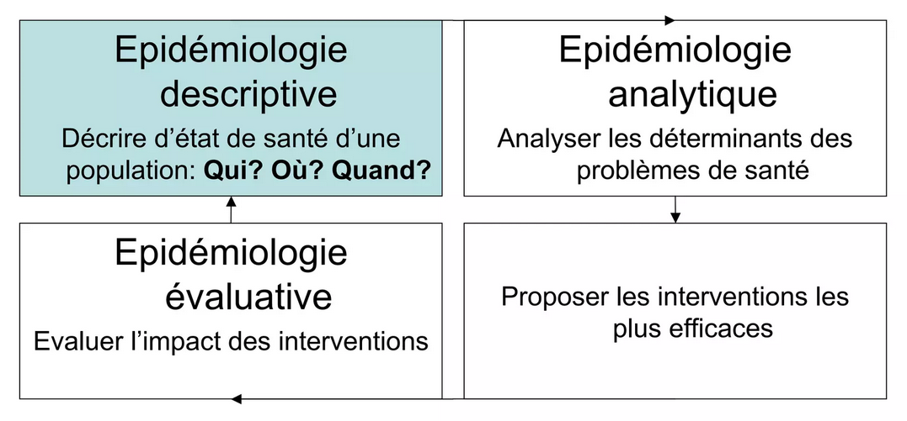

# Définitions {#sec-def}

> *"La santé est un état de complet bien-être physique, mental et social, et ne consiste pas seulement en une absence de maladie ou d'infirmité."*

::: {.p style="text-align:right"}
Préambule de la constitution de l'OMS, 1946
:::

---

## L'épidémiologie

Le terme ["épidémiologie"]{.cb1} est composée de *epi* ("au-dessus/parmi"), *demos* ("peuple") et  *logos* ("discours/connaissance"). C'est donc classiquement, par extrapolation, [la science de ce qui affecte la population]{.cb1}.

Historiquement, c'était une discipline consacrée à l'étude des maladies infectieuses ("épidémies").
L'épidémiologie s'est diversifiée et vise désormais à étudier, de manière plus générale :

::: {.p style="text-align:center; padding:0.5rem;"}
**la [distribution]{.cb1} d'un phénomène de santé dans une population humaine** \
**ainsi que les [déterminants]{.cb1} de cette distribution**
:::

::: callout-note
## Phénomène de santé ?
Un phénomène de santé, ou état de santé, fait référence à [tout évènement]{.cb1} relatif à la santé d'une personne ou d'une population. Il n'est donc [pas forcément synonyme de maladie]{.cb1} : il peut aussi s'agir d'un symptôme, de la mort, de facteurs comportementaux (e.g., consommation de tabac, pratique d'activité physique) ou socio-économiques.
:::

### Pour quoi ?

```{r}
#| out-width: 6in
#| fig-align: center


```

::: callout-tip
## Étude des maladies cardiovasculaires

1. **Décrire : épidémiologie descriptive**
: La collecte de données provenant d'enquêtes nationales a permis d'identifier que les maladies cardiovasculaires étaient plus fréquentes chez les adultes âgés de plus de 50 ans ayant des comportements à risque tels que le tabagisme ou une alimentation riche en sel.

2. **Comprendre : épidémiologie analytique**
: Des études visant à rechercher des liens entre les facteurs de risque potentiels et la survenue de maladies cardiovasculaires ont pu montrer que les personnes les plus à risque étaient celles ayant, ente autres, une pression artérielle élevée ou un diabète mal contrôlé.

3. **Évaluer : épidémiologie évaluative**
: Analyser les données avant et après la mise en place de campagnes de sensibilisation sur les facteurs de risque de maladies cardiovasculaires (e.g., promouvoir l'activité physique, une alimentation plus saine)
:::


### Pour qui ?

- [Les professionnels de santé]{.cb1}
: Ils jouent un rôle important dans la mise en oeuvre des interventions de santé, allant de la prévention à la prestation de soins. Leur expertise est nécessaire pour assurer des interventions efficaces et adaptées aux besoins de la populations.

- [Les politiques et administrations]{.cb1}
: Leur rôle consiste à élaborer des programmes répondant aux besoins de la population et favorisant l'accès au système de santé (e.g., campagnes de sensibilisation, promotion de la santé)

- [Les gestionnaires]{.cb1}
: Chargés de planifier, d'allouer et d'organiser les ressources nécessaires services de santé, leur rôle consiste à garantir que les ressources sont utilisées de manière efficace pour répondre aux besoins de la population (e.g., organiser des campagnes de vaccination en cas d'épidémie)

- [Les usagers]{.cb1}
: Ils doivent être en mesure de défendre leurs droits en matière de santé, en revendiquant des politiques et des services adaptés à leurs besoins (e.g., patients, associations de patients)


## L'épidémiologie descriptive

L'[épidémiologie descriptive]{.cb1} a pour objectif de [décrire]{.cb1} un [phénomène de santé]{.cb1} dans un groupe ou une [population]{.cb1}, en termes de :

- **Fréquence** : quelle est l'ampleur d'un phénomène de santé
- **Répartition** : comment est-il distribué selon divers facteurs démographiques, socio-économiques, etc.
- **Évolution** : comment sa fréquence et sa répartition évoluent dans le temps
- **Caractéristiques** : quels mécanismes décrire (e.g., biologiques, comportementaux)

::: callout-tip
## Étude de l'obésité
- Déterminer la prévalence de l'obésité
- Identifier les régions où elle est la plus répandue
- Suivre l'évolution au fil des années
- Analyser les caractéristiques des populations les plus touchées
:::

L'épidémiologie descriptive repose sur l'utilisation d'[indicateurs de santé]{.cb1} (@sec-indic).

Ses objectifs sont multiples :

- [Surveillance et contrôle sanitaire]{.cb1}

::: callout-tip
## Repérage des individus atteints de maladies infectieuses pour agir (exemples)

- **Pandémie de Covid-19** : isolement
- **Tuberculose** : traitement des malades
- **Méningite bactérienne** : traitement prophylactique de l'entourage (vaccination)
- **Toxi-infection alimentaire collective (TIAC)** : repérage et neutralisation de la source contaminante
:::

- [Meilleure connaissance des besoins de prise en charge de la population]{.cb1}

::: callout-tip
## Le risque d'avoir un enfant atteint de trisomie 21 augmente avec l'âge maternel
Une meilleure compréhension de ce phénomène permet d'adapter la prise en charge de la population, notamment en matière de consultation génétique et de dépistage anténatal.
:::

- [Évaluation d'une action de santé]{.cb1}

::: callout-tip
## Efficacité de la vaccination pour diminuer le nombre d'hospitalisations et de décès dus au Covid
L'évaluation peut consister à comparer la survenue des nouveaux cas, les taux d'hospitalisation et de mortalité avant et après couvertures vaccinales.
:::

- [Formulation d'hypothèses pour la recherche analytique]{.cb1}

::: callout-tip
## Il existe un gradient nord-sud décroissant dans la survenue des maladies cardiovasculaires
Ce phénomène a ouvert la voie vers une recherche complexe et multidimensionnelle (e.g., influence climatique, exposition solaire, facteurs génétiques, facteurs socio-économiques).
:::

---
\

::: {.p style="text-align:center"}
## À RETENIR {.unnumbered .unlisted}
:::

::: callout-important
# L'épidémiologie vise à décrire des phénomènes de santé dans une population et rechercher les facteurs qui les déterminent
:::

::: callout-important
# Deux grandes catégories : descriptive et analytique
:::
