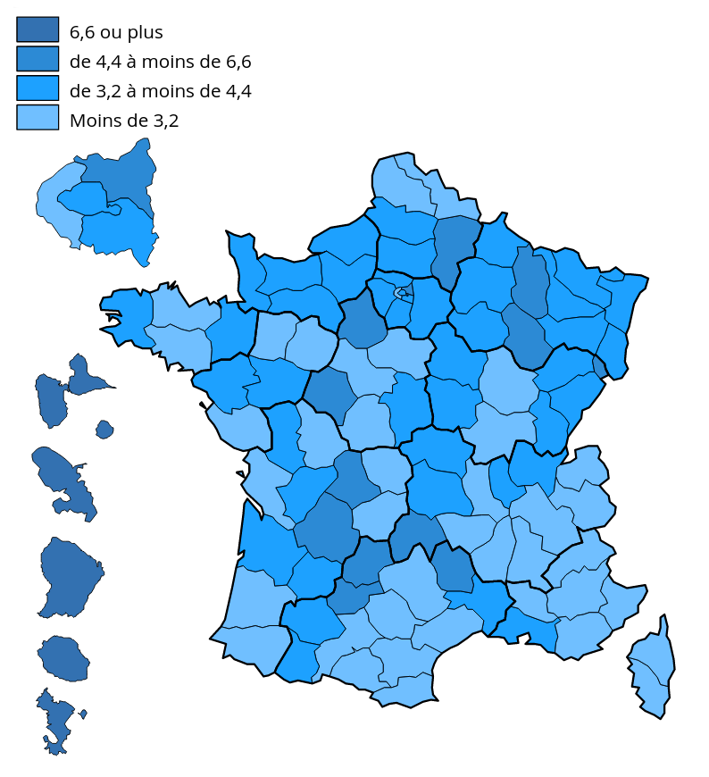
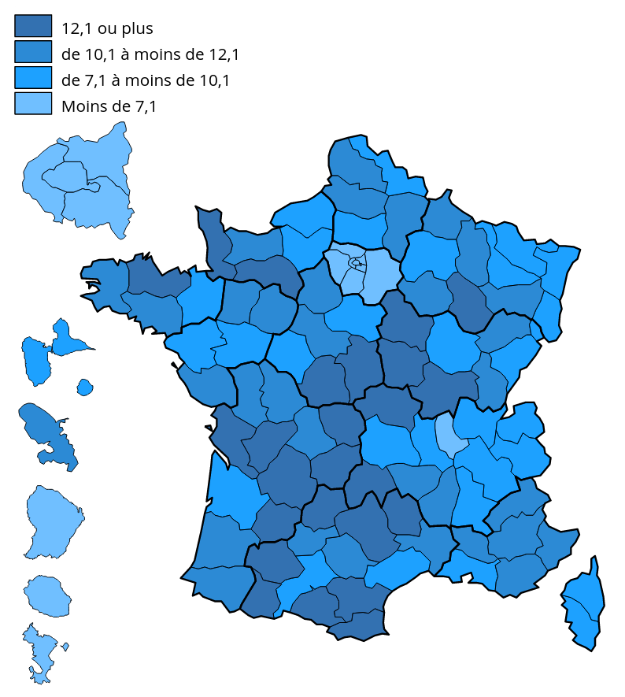
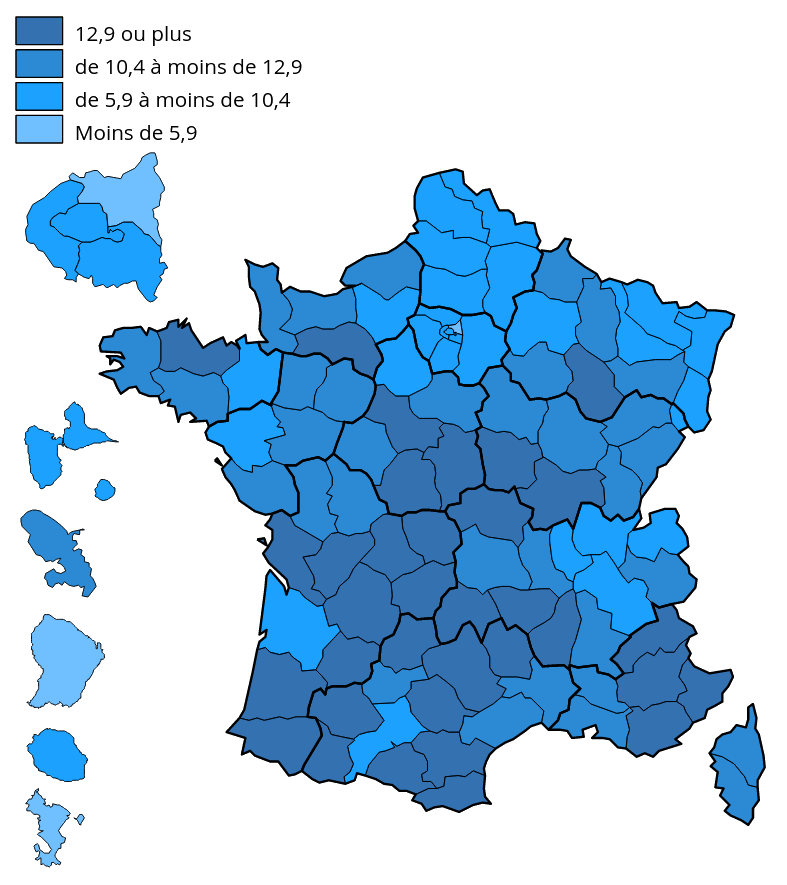
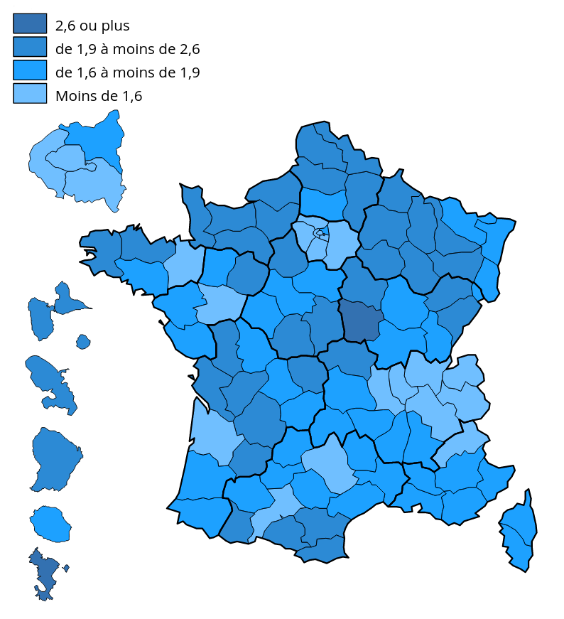

# Indicateurs de mortalité {#sec-mrt}

Un indicateur de [mortalité]{.cb1} a pour but de décrire la [fréquence des décès]{.cb1} dans une population.

Il en existe trois types :

- Taux [brut]{.cb1}
- Taux [spécifique]{.cb1}
- Taux [standardisé]{.cb1}

## Taux brut de mortalité

Un [taux brut de mortalité]{.cb1} est un [taux]{.cb1} (@sec-taux) appliqué à [la survenue de décès]{.cb1} dans une population.

$$
\frac
  {\text{Nombre de décès}}
  {\text{Ensemble de la population}}
\text{ sur une période donnée}
$$

Il est généralement calculé sur un an et exprimé en taux pour 1000.

::: callout-note
## Pourquoi en "taux pour 1000" ?

Le nombre de décès étant logiquement inférieur à l'effectif total de la population, le taux tel qu'il est calculé est [toujours inférieur à 1]{.cb1}.

Supposons que, sur l'année 2022, le taux brut de mortalité en France soit égal à 0,009.\
L'énoncé suivant n'est pas très intuitif :

> En France, en 2022, le taux brut de mortalité était de **0,009 pour 1 habitant**.

En pratique, on procède à une multiplication par 1000 (ou plus) :

> En 2022, le taux brut de mortalité était de **9 pour 1000 habitants**.

On comprend ainsi facilement que, en moyenne, pour 1000 personnes suivies sur l'année 2022, 9 sont décédées.

Cette transformation facilite également les comparaisons entre différentes tailles de populations.
:::

## Taux spécifique de mortalité

Un [taux spécifique de mortalité]{.cb1} est un taux de mortalité dans lequel on tient compte d'un autre paramètre.
Il s'agit le plus souvent de taux spécifiques par sexe, par tranches d'âges, ou par causes de décès.

$$
\frac
  {\text{Nombre de décès dans le sous-groupe}}
  {\text{Effectif de la population dans le sous-groupe}}
\text{ sur une période donnée}
$$

::: callout-tip
## En France, entre 2020 et 2022, le taux de mortalité infantile était de 3,7 pour 1000 naissances vivantes.

Sur 1000 enfants nés vivants entre 2020 et 2022, environ 4 en moyenne sont décédés avant l'âge de 12 mois.

```{r}
#| label: fig-mort-inf
#| out-width: 70%
#| fig-align: center
#| fig-cap: "Taux de mortalité infantile entre 2020 et 2022 (en ‰).<br>[Source : [Insee](https://www.insee.fr/fr/statistiques/2012741)]{.quarto-float-subcaption}"


```
:::

::: callout-tip
## En 2022, le taux de mortalité chez les femmes enceintes était de 9,6 pour 100 000 accouchements.
:::

Il existe plusieurs types de taux de mortalité spécifique, dont :

- La mortalité [prématurée]{.cb1} : mortalité survenant avant 65 ans (= taux spécifique par tranches d'âge)
- La mortalité [évitable]{.cb1} : taux spécifique par causes de décès


## Taux standardisé de mortalité {#sec-stand}

### Problème

Indépendamment de ses causes, la mortalité est liée à un facteur incontournable : [l'âge]{.cb1}.

Si la comparaison entre départements révèle des taux plus élevés dans l'un, cela peut-être dû non pas à des causes externes mais simpl ement à la [structure d'âge]{.cb1} du département : [la mortalité est plus élevée si la moyenne d'âge est plus élevée]{.cb1}.

::: {#fig-mort layout-ncol=2}

{#fig-mort-brut}

{#fig-mort-part-75}

Taux bruts de mortalité et part des plus de 75 ans en 2023 (en ‰).<br>[Source : [Insee](https://www.insee.fr/fr/statistiques/2012741)]{.quarto-float-subcaption}
:::

::: callout-note
## L'âge est un [facteur de confusion]{.cb1} (@sec-biais-conf) dans la mesure des taux comparatifs de mortalité
:::

### Solution

Afin de pouvoir comparer de manière pertinente des taux de mortalité entre différentes zones géographiques, il faut procéder à un traitement des taux bruts pour s'affranchir de cet "effet âge" : cette méthode est appelée [standardisation]{.cb1}.

Les taux comparatifs de décès, ou [taux standardisés]{.cb1}, correspondent à des taux de décès calculés [comme si la structure d'âge était la même dans tous les départements]{.cb1}.

```{r}
#| label: fig-stand
#| out-width: 65%
#| fig-align: center
#| fig-cap: "Taux standardisés de mortalité prématurée (< 65 ans) en 2023 (en ‰).<br>[Source : [Insee](https://www.insee.fr/fr/statistiques/2012741)]{.quarto-float-subcaption}"


```

Après standardisation, on peut supposer que les taux de mortalité observés dépendent non plus de la structure d'âge dans chaque région, mais bien de [facteurs externes]{.cb1}.

## Taux de létalité

Tandis que la mortalité représente le nombre d'individus décédés sur l'ensemble de la population, la [létalité]{.cb1} représente le nombre d'individus décédés d'une maladie [parmi les personnes atteints de cette maladie]{.cb1}.

Un [taux de létalité]{.cb1} prend pour période d'étude [le temps à partir du début]{.cb1} de la maladie.

$$
\frac
  {\text{Nombre de décès d'une maladie}}
  {\text{Nombre de personnes atteintes de la maladie}}
\text{ depuis le début de la maladie}
$$

Elle est exprimée en temps depuis le début de la maladie (e.g. létalité à 28 jours, létalité à un an).

C'est un indicateur de la [gravité]{.cb1} d'une maladie.

::: callout-tip
## Pendant la première phase de l'épidémie de Covid à Wuhan, la létalité du Covid était de 17,3% pour les cas survenus durant les deux premières semaines de janvier 2020.

Sur 100 cas de Covid survenus durant cette période, 17 sont décédés.
:::

::: callout-warning
## Un taux de létalité n'est pas un taux de mortalité spécifique d'une cause de décès

La différence se situe au dénominateur :

- Le taux de mortalité spécifique d'une maladie sur une période donnée correspond au nombre de personnes décédées de la maladie [parmi l'ensemble de la population]{.cb1}.
- Le taux de létalité d'une maladie sur cette même période correspond au nombre de personnes décédées de la maladie [parmi les personnes atteintes de la maladie]{.cb1}.

La mortalité spécifique est un indicateur de la charge globale de la maladie sur la société, tandis que la létalité est cruciale pour comprendre et gérer les risques pour les individus atteints d'une maladie donnée.

:::

## Espérance de vie

```{r}
library(gt)

table_esp <- \(young, old) {

  tibble::tibble(
    " " = c("Hommes", "Femmes"),
    "À la naissance" = young,
    "À 65 ans" = old
  ) |>
    gt() |>
    tab_style(
      style = cell_text(weight = "bold"),
      locations = list(
        cells_column_labels(),
        cells_body(columns = 1)
      )
    )

}
```

L'espérance de vie est le [nombre moyen d'années]{.cb1} qu'une personne peut espérer vivre [à partir d'un âge donné]{.cb1}.

L'espérance de vie [en bonne santé]{.cb1} (ou espérance de vie [sans incapacité]{.cb1}) est le nombre moyen d'années qu'une personne peut espérer vivre sans souffrir d'incapacité dans les gestes de la vie quotidienne.

::: panel-tabset

# Espérance de vie

```{r}
#| label: tbl-esp-base
#| tbl-cap: Espérance de vie en France, 2022.

table_esp(
  young = c(79.3, 85.1),
  old = c(19.1, 23.0)
)
```

# Espérance de vie en bonne santé

```{r}
#| label: tbl-esp-bs
#| tbl-cap: Espérance de vie en bonne santé en France, 2022.

table_esp(
  young = c(63.8, 65.3),
  old = c(10.2, 11.8)
)
```

:::

Source : [Insee](https://www.insee.fr/fr/statistiques/2012741)

***

\

::: {.p style="text-align:center"}
## À RETENIR {.unnumbered .unlisted}
:::

::: callout-important
# Bien distinguer mortalité et létalité
:::

::: callout-important
# La standardisation est indispensable dès lors qu'on souhaite comparer des taux de mortalité
:::
