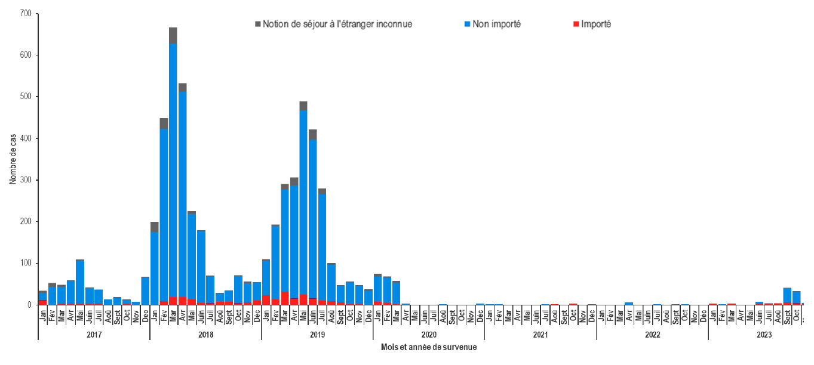

# Recueils systématiques {#sec-src-base}

## Déclaration obligatoire

Sont présentés ici deux systèmes de déclaration obligatoire :

- Le [certificat de décès]{.cb1}
- La liste des [maladies à déclaration obligatoire]{.cb1}


### Certificat de décès

La déclaration d'un décès par un [certificat de décès](https://cepidc.inserm.fr/causes-medicales-de-deces/comment-sont-produites-les-donnees) est une [obligation légale]{.cb1} pour toute personne décédée sur le territoire national, y compris un enfant enregistré à l'état civil (en cas d'enfant mort-né, il doit être établit un acte d'enfant sans vie, attestant que l'enfant était mort au moment de la naissance).

Le certificat de décès doit être produit [par le médecin ayant constaté le décès]{.cb1} (cette habilité pourrait cependant être [étendue](https://www.ameli.fr/infirmier/exercice-liberal/prescription-prise-charge/prise-charge-situation-type-soin/certificats-deces-par-infirmier)).

Il se compose de deux volets :

| [ADMINISTRATIF]{.cb1}<br>déclaration à l'état civil | [MÉDICAL]{.cb1}<br>suivi épidémiologique |
|:---:|:---:|
| nom et prénom  | renseignements médicaux    |
| domicile   | date et commune du décès    |
| date et heure du décès    |    |
| divers opérations funéraires    |      |

\

Un certificat de décès correctement rempli participe à l'amélioration de la [veille sanitaire]{.cb1}, à la qualité des [statistiques de mortalité]{.cb1} et à la [comparabilité]{.cb1} entre régions et pays (bien que la qualité de remplissage puisse varier d'un lieu à l'autre).


### Maladies à déclaration obligatoire {#sec-mdo}

En 2024, il existe 38 [Maladies à Déclaratoire Obligatoire](https://www.santepubliquefrance.fr/maladies-a-declaration-obligatoire/liste-des-maladies-a-declaration-obligatoire) (MDO). Elles ont en commun d'être des [maladies infectieuses]{.cb1}, à deux exceptions (le mésothéliome et le saturnisme chez l'enfant mineur).

C'est un système de [transmission de données individuelles]{.cb1} à l'Agence Régionale de Santé (ARS), dans lequel deux procédures sont mises en jeu :

| [SIGNALEMENT]{.cb1} | [NOTIFICATION]{.cb1} |
|:---:|:---:|
| **nominatif**<br>pour engager des mesures préventives | **anonyme**<br>pour le suivi épidémiologique |
| maladies nécessitant une **intervention urgente**<br>*(toutes sauf VIH, hépatite B aiguë, tétanos, mésothéliome et Covid-19)*. | **toutes les maladies** sans exception |

---

::: {.p style="text-align:center"}
le signalement doit être réalisé
: en [urgence]{.cb1} et [sans délai]{.cb1} \
[dès la suspicion]{.cb1} de la maladie \
par les [médecins et biologistes]{.cb1}
:::

---

Le caractère [obligatoire]{.cb1} de cette transmission permet une surveillance [continue]{.cb1} et un recueil d'information [exhaustif]{.cb1} (@sec-exhaust) vis-à-vis des maladies listées.

::: callout-note
## Pour figurer sur cette liste, la maladie doit répondre à deux types de critères

Critères principaux :

  - **Gravité** : elle peut entraîner des complications graves ou même la mort.
  - **Transmissibilité** : elle doit avoir un potentiel de transmission significatif justifiant une surveillance pour prévenir de possibles épidémies.
  - **Présence de mesures efficaces** : il existe des interventions efficaces pour contrôler ou prévenir la maladie (e.g., vaccination, traitements anti-infectieux, mesures de quarantaine).

Critères de faisabilité :

  - **Capacités diagnostiques** : la maladie doit être identifiable par des méthodes disponibles et fiables.
  - **Capacités structurelles** : le système de santé doit être capable de gérer la déclaration et le suivi des cas sans surcharge excessive.
  - **Utilité des données collectées** : la surveillance de la maladie doit apporter des informations qui améliorent les connaissances et contribuent ainsi à une meilleure prévention de la maladie.

:::

En résumé, ce système garantit une [surveillance continue]{.cb1} à la fois pratique et utile de [maladies potentiellement graves]{.cb1} afin de permettre une réponse rapide et efficace en cas de risque épidémique.

```{r #fig-rougeole}
#| fig-cap: "Évolution des cas de rougeole déclarés, selon l’origine importée ou non, 2017-2023, France entière.<br><span class='quarto-float-subcaption'>Source : SPF, déclarations obligatoires.</span>"


```


## Déclaration volontaire

Le [réseau Sentinelles](https://sentiweb.fr/) est un système de [surveillance continue]{.cb1} basé sur le [volontariat]{.cb1}.

Il permet le recueil, l'analyse et la prévision [en temps réel]{.cb1} de données issues de l'activité de [1300 médecins généralistes libéraux]{.cb1} répartis sur l'ensemble du territoire métropolitain.

Les professionnels de santé appartenant à ce réseau [s'engagent à signaler tous les cas]{.cb1} de maladies surveillées auprès d'un centre coordinateur.

Tout comme le système de déclaration obligatoire, l'objectif est de [contrôler ou prévenir un risque d'épidémie]{.cb1}.
Toutefois puisqu'il s'agit d'une déclaration [volontaire]{.cb1}, l'exhaustivité ne peut pas être recherchée, mais des efforts sont faits localement afin d'arriver à un certain degré de [représentativité]{.cb1}.

Actuellement, [9 pathologies]{.cb1} bénéficient d'une surveillance continue :

- [Diarrhée aiguë]{.cb1}
- [Infection respiratoire aiguë (syndromes grippaux et COVID-19)]{.cb1}
- [Varicelle]{.cb1}
- Oreillons
- Urétrite masculine
- Zona
- Borréliose de Lyme
- Coqueluche
- Suicide et tentative de suicide

La situation des trois premières est actualisée [chaque mercredi]{.cb1} et représentée graphiquement à un niveau national (par interpolation des données obtenues localement).

::: {#fig-senti layout-nrow=1}

{#fig-senti-a}

{#fig-senti-b}

{#fig-senti-c}

Situation observée en France métropolitaine par le réseau Sentinelles (semaine 52, 2024).

:::


## Bases de données médico-administratives

Le [Système National des Données de Santé](https://www.assurance-maladie.ameli.fr/etudes-et-donnees/en-savoir-plus-snds/presentation-systeme-national-donnees-sante-snds) (SNDS) a été crée en 2016. Il s'agit d'une base de données elle-même construite à partir de plusieurs sources de données :

- Données de remboursement des régimes d'Assurance Maladie (base SNIIRAM)
- Données des hospitalisations (base PMSI)
- Causes médicales de décès (CépiDC)
- Données relatives aux handicap (MDPH)
- Données relatives à l'infection à Covid-19 (bases Vaccin Covid et SI-DEP)
- Échantillons de données des complémentaires santé

Ses finalités sont multiples :

- [Aide à la recherche ou l'évaluation présentant un caractère publique]{.cb1}

::: callout-tip
## Étude de l'efficacité de nouveaux traitements contre le diabète de type II en conditions réelles

Les chercheurs peuvent accéder à des informations détaillées sur les résultats des traitements administrés à large échelle, permettant d'évaluer leur efficacité et leur sécurité dans des conditions réelles d'utilisation.
:::

- [Aide à la mise en oeuvre de politiques de santé]{.cb1}

::: callout-tip
## Comparaison des taux de vaccination entre différentes régions

Permet d'adapter les campagnes de vaccination pour cibler les zones où le taux de vaccination est faible, assurant une meilleure couverture vaccinale globale.
:::

- [Meilleure connaissance des dépenses de santé]{.cb1}

::: callout-tip
## Analyse des tendances de consommation de traitements liés aux maladies chroniques

Aide les autorités sanitaires à planifier des budgets plus précis et à envisager des mesures pour contrôler les dépenses, telles que la promotion des médicaments génériques.
:::

- [Surveillance, veille et sécurité sanitaire]{.cb1}

::: callout-tip
## Suivi de l'évolution d'épidémies de grippe saisonnière en temps réel

Permet d'adapter rapidement les réponses sanitaires et de contrôler la propagation.
:::


## Limites des données de routine

- Informations limitées
: Les données peuvent être incomplètes ou ne pas couvrir tous les aspects nécessaires pour une évaluation complète.

- Pas de choix des données
: Les données disponibles ne sont pas toujours celles choisies, ce qui peut affecter l'interprétation et l'utilisation de ces informations en pratique.

- Pas de définition standardisée
: La variabilité avec laquelle sont définies les critères peut conduire à des confusions ou à des erreurs d'interprétation si elle n'est pas prise en compte.

- Pas de contrôle de qualité des données
: Les données peuvent être de qualité variable, insuffisamment contrôlées pour assurer leur fiabilité.

\

Pour pallier à ces limites, il peut être nécessaire de réaliser des [enquêtes spécifiques]{.cb1} (@sec-src-spe).

---

\

::: {.p style="text-align:center"}
## À RETENIR {.unnumbered .unlisted}
:::

::: callout-important
# Un système de déclaration obligatoire permet un recueil d'information exhaustif
:::

::: callout-important
# La déclaration d'un décès est une obligation légale
:::

::: callout-important
# Sauf exceptions, les MDO sont des maladies infectieuses
:::

::: callout-important
# Le signalement d'une MDO doit être réalisé en urgence, dès la suspicion
:::
