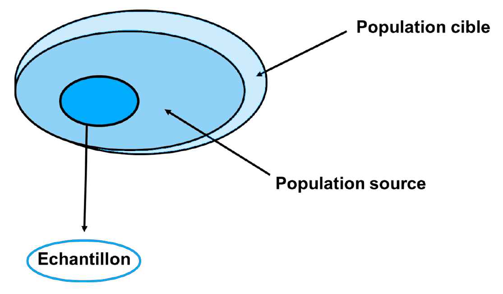
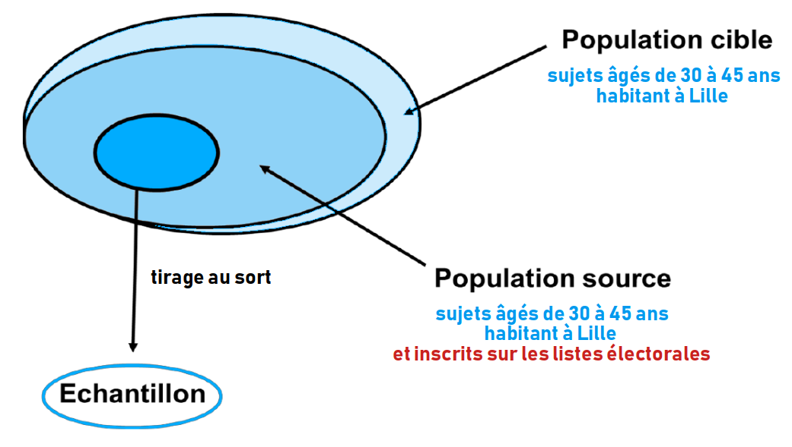

# Enquêtes spécifiques {#sec-src-spe}

Des enquêtes peuvent être réalisées pour répondre à un besoin spécifique d'information [en l'absence de données de routine]{.cb1}, et si la pathologie d'intérêt s'y prête.

On distingue deux types d'enquêtes spécifiques (aussi appelées enquêtes "ad hoc") :

- Enquête [exhaustive]{.cb1} (en population) (@sec-part-exhaust)
- Enquête sur [échantillon représentatif]{.cb1} (@sec-echant)

Terminologie :

::: {layout-ncol=3}

```{r}
tibble::tibble(Population = c("Exhaustive", "Représentative")) |> 
  knitr::kable(align = "c")
```

```{r}
tibble::tibble(Durée = c("Transversale", "Longitudinale")) |> 
  knitr::kable(align = "c")
```

```{r}
tibble::tibble(Chronologie = c("Prospective", "Rétrospective")) |> 
  knitr::kable(align = "c")
```

:::


## Enquête exhaustive {#sec-part-exhaust}

### L'exhaustivité {#sec-exhaust}

La notion d'[exhaustivité]{.cb1} a déjà été abordée (@sec-mdo).

L'exhaustivité se dit d'une situation où l'on a pu recueillir l'information sur [la totalité]{.cb1} des cas qui constituaient la population.

Une [enquête exhaustive]{.cb1} vise à collecter des informations [aussi complètes que possible]{.cb1}, en couvrant tous les aspects pertinents du sujet d'étude pour réduire les lacunes des données pré-existantes.


::: {.callout-caution collapse="true" appearance="minimal"}
## Que veut-on dire lorsqu'on parle de "liste exhaustive" ? 
Une liste exhaustive est une liste [complète]{.cb1}, qui explicite tous les éléments qui la composent.
:::

Un exemple d'enquête exhaustive est le [registre de morbidité]{.cb1}.

### Registre de morbidité

Il s'agit d'un enregistrement [continu et exhaustif]{.cb1} de [l'ensemble]{.cb1} des cas :

1. Pour [une pathologie donnée]{.cb1}
2. Sur un [territoire géographique donné]{.cb1}

Pour une pathologie donnée, un registre permet d'étudier :

- Son incidence
- Sa mortalité
- Sa létalité

Ce type d'enquête s'inscrit avant tout dans une démarche [descriptive]{.cb1}, mais peut aussi aider à l'évaluation d'actions de santé publique (e.g. impact d'une campagne de dépistage).

::: callout-tip
## Les pathologies sont diverses et doivent être [facilement repérables]{.cb1} : 

- Registre de cancers (les plus nombreux)
- Registre des maladies inflammatoires du tube digestif
- Registre des malformations congénitales
- Registre des AVC
:::

::: callout-tip
## Le registre des AVC dans la Métropole Européenne de Lille (MEL)

Il s'agit d'un enregistrement continu et exhaustif de tous les nouveaux cas d'AVC ([pathologie donnée]{.cb1}) chez les habitants de la MEL ([territoire géographique donné]{.cb1}).
:::


## Enquête sur échantillon représentatif {#sec-echant}

On en distingue deux types :

- Enquête [transversale]{.cb1} (@sec-spe-trans)
- Enquête [longitudinale]{.cb1} (@sec-spe-long)

### La représentativité {#sec-repres}

Il n'est parfois (et même souvent) pas possible d'avoir accès à toute une population (effectifs trop grands, manque de moyens...).
Une solution est de réaliser un [échantillonnage]{.cb1} de cette population.

Un [échantillon]{.cb1} est un sous-ensemble, une portion de taille variable d'une population.
Il doit être rigoureusement constitué : on veut qu'il soit [un bon reflet]{.cb1} de la population de laquelle il est issu. 

::: {.p style="text-align:center"}
**Autrement dit, on veut que l'échantillon soit [représentatif]{.cb1} de sa population d'origine**
:::

::: callout-note
## Pourquoi est-ce important ?

Admettons qu'une équipe de chercheurs ait pour objectif de connaitre la prévalence d'une maladie dans une population.
Pour ce faire, un échantillon est constitué et une prévalence est mesurée à partir de cet échantillon.

Pourtant, l'objectif de l'étude est bel et bien de connaitre la prévalence [dans la population]{.cb1}, et non dans l'échantillon.

L'échantillon n'est effectivement qu'un [intermédiaire]{.cb1} : la finalité d'une telle étude est de faire une [estimation]{.cb1}, à partir de la prévalence obtenue dans l'échantillon, de la [vraie prévalence]{.cb1} dans la population (valeur que l'on ne connaîtra jamais, à moins d'avoir accès à l'ensemble de la population !).

Une bonne représentativité permet de [généraliser]{.cb1} la valeur obtenue sur l'échantillon à sa population d'origine en garantissant un certain degré d'exactitude, raison pour laquelle [elle doit toujours être recherchée]{.cb1}.
Plus un échantillon est représentatif de sa population, plus l'estimation est [proche de la vraie valeur]{.cb1}.

Un échantillon mal constitué, non représentatif de sa population d'origine, serait pourvoyeur de [biais de sélection]{.cb1} (@sec-biais-sel). La généralisation de ses résultats pourrait mener à des conclusions erronées.
:::

La constitution d'un échantillon fait intervenir trois étapes successives : 

1. [Population cible]{.cb1} : ensemble de la population ciblée par l'enquête 
2. [Population source]{.cb1} : part de la population cible accessible en pratique
3. [Échantillon]{.cb1} : sélection issue de la population source

```{r #fig-pop-1}
#| out-width: 6in
#| fig-align: center
#| fig-cap: "De la population à l'échantillon"


```

::: callout-tip
## Prévalence de l'obésité chez les sujets âgés de 30 à 45 ans habitant à Lille (partie I)

La population à laquelle on souhaite accéder est définie dès le départ.
Il s'agit des **sujets âgés de 30 à 45 ans habitant à Lille** : c'est la [population cible]{.cb1}.
"Cible" car il s'agit bien de l'ensemble de la population ciblée par notre question de recherche. C'est la population à laquelle on souhaite [généraliser]{.cb1} les résultats.

On souhaite, à partir de cette population théorique, constituer un échantillon.
Or il faut pour cela trouver un moyen pratique d'accéder à cette population. \
La solution idéale ? Trouver une liste qui contiendrait un maximum de sujets appartenant à notre population cible.
Très souvent, les listes électorales remplissent plutôt bien cette fonction.

La part de la population cible accessible en pratique est ainsi définie : il s'agit des **sujets âgés de 30 à 45 ans habitant à Lille** [ET]{.cb1} **inscrits sur les listes électorales de la commune de Lille** : c'est la [population source]{.cb1}.
"Source" car il s'agit bien de la part de la population cible à partir de laquelle on pourra constituer notre échantillon.

Enfin, un certain nombre de sujets appartenant à la population source seront sélectionnés par tirage au sort à partir des listes électorales : c'est l'[échantillon]{.cb1}.

```{r #fig-pop-2}
#| out-width: 6in
#| fig-align: center
#| fig-cap: "De la population à l'échantillon (exemple)"


```

La prévalence de l'obésité sera finalement mesurée dans cet échantillon.
:::

::: {.p style="text-align:center"}
**L'échantillon finalement constitué doit être [représentatif de la population cible]{.cb1}**
:::

Par conséquent, cette représentativité doit être garantit à chaque niveau :

1. La population [source]{.cb1} doit être représentative de la population [cible]{.cb1}
: La constitution de la population source sur la base d'une liste électorale garantit une bonne représentativité vis-à-vis de la population cible (on considère que les personnes qui votent ont les mêmes caractéristiques que celles qui ne votent pas).

2. **L'[échantillon]{.cb1} doit être représentatif de la population [source]{.cb1}**


### Enquête transversale {#sec-spe-trans}

La notion de transversalité ayant déjà été abordée (@sec-mrb), vous devriez être en mesure de répondre aux questions suivantes.

::: {.callout-caution collapse="true" appearance="minimal"}
## L'objectif d'une enquête transversale est-il de mesurer une incidence ou une prévalence ?
Mesure transversale = mesure prise à un instant donné \
Une enquête transversale consiste donc à mesurer une [prévalence]{.cb1} (@sec-prev)
:::

::: {.callout-caution collapse="true" appearance="minimal"}
## Les sujets inclus dans une étude transversale sont-ils suivis dans le temps ?
La réalisation d'une mesure à un instant donné signifie justement qu'il n'y a [pas de suivi dans le temps]{.cb1}
:::

Ce type d'enquête a un champ d'application plutôt restreint. Il est adapté à des maladies suffisamment [fréquentes]{.cb1} pour pouvoir être étudiées [ponctuellement]{.cb1} avec une précision raisonnable.


::: callout-tip
## L'étude portant sur l'obésité présentée plus haut (@sec-repres) est un exemple d'enquête transversale
:::

::: callout-tip
## Enquête MONA-LISA-Lille (2005-2007)

Objectif
: - Mesurer la prévalence des principaux facteurs de risque cardiovasculaire dans la métropole européenne de Lille (MEL)

Échantillon représentatif
: - Tirage au sort sur les listes électorales avec stratification sur la taille des communes
- 1600 hommes et femmes, âgés de 35 à 74 ans et résidant dans la MEL

Invitation par courrier
: - Mesures (e.g., poids, taille, pression artérielle, fréquence cardiaque)
- Prise de sang à jeun (glycémie à jeun, cholestérolémie)

Exemple de résultat
: - La prévalence de l'HTA dans la MEL était de 53% chez les hommes et de 45% chez les femmes
:::


### Enquête longitudinale {#sec-spe-long}

La notion de longitudinalité ayant déjà été abordée (@sec-mrb), vous devriez être en mesure de répondre aux questions suivantes.

::: {.callout-caution collapse="true" appearance="minimal"}
## L'objectif d'une enquête longitudinale est-il de mesurer une incidence ou une prévalence ?
Mesure longitudinale = mesure réalisée dans le temps, sur une période donnée \
Une enquête longitudinale consiste donc à mesurer une [incidence]{.cb1} (@sec-prev)
:::

::: {.callout-caution collapse="true" appearance="minimal"}
## Les sujets inclus dans une étude longitudinale sont-ils suivis dans le temps ?
La réalisation d'une mesure sur une période donnée signifie justement qu'il y a [un suivi dans le temps]{.cb1}
:::

Une enquête longitudinale est en pratique appelée [étude de cohorte]{.cb1}.

Classiquement, une [cohorte]{.cb1} est un groupe de personnes [suivies dans le temps]{.cb1}, servant à la réalisation d'études épidémiologiques présentant un intérêt de santé publique.

C'est parce qu'il y a un suivi qu'on parle de cohortes [prospectives]{.cb1} : on mesure la survenue d'un évènement dans le temps. Il s'agit du cas le plus fréquent (il existe aussi des cohortes rétrospectives : on cherche à retrouver une information passée).


::: callout-tip
## La cohorte PAQUID (1988-2004)
- **Inclusion** : 3777 sujets âgés de 65 ans et plus vivant en région Aquitaine
- **Objectif** : étude du vieillissement cérébral et fonctionnel en population générale
- **Suivi** : tous les deux ans à 11 reprises
- **Résultat** : la démence était la cause principale de dépendance du sujet âgé en France
:::

::: callout-tip
## La plus importante cohorte en population française : [CONSTANCES](https://www.constances.fr/) (2012 - )

Objectif
: - Recueil de données variées pour suivre l'état de santé, la morbidité, la mortalité, les facteurs de risque et les caractéristiques socio-démographiques de ses participants
- Vise à couvrir un large éventail de problèmes de santé et leurs déterminants, sans se limiter à une question de recherche spécifique, facilitant ainsi l'analyse d'une multitude de problèmes scientifiques dans le domaine de la santé

Protocole
: - 220 000 volontaires âgés de 18 à 69 ans et affiliés au Régime général de sécurité sociale inclus entre 2012 et 2021
- Données recueillies par des questionnaires complétés à domicile ou administrés par les médecins dans les centres d'examens de santé 


Exemples d'études réalisées ou en cours
: - Développement d'un algorithme d'identification de la dégénérescence maculaire liée à l'âge
- Étude des liens entre les expositions environnementales vie entière et la santé cardio-métaboliques
- Impact des violences sexuelles sur la santé mentale et la consommation de substances psycho-actives
- Évolution de la morphologie de la population française
- Rôle de la consommation de cannabis dans les comportements suicidaires
:::

---

\

::: {.p style="text-align:center"}
## À RETENIR {.unnumbered .unlisted}
:::

::: callout-important
# Deux types d'enquêtes spécifiques : exhaustive ou sur échantillon représentatif
:::

::: callout-important
# Un échantillon doit être représentatif de la population de laquelle il est issu
:::

::: callout-important
# Un registre de morbidité est une enquête exhaustive : c'est un recueil continu de tous les cas d'une pathologie donnée dans une zone géographique donnée
:::

::: callout-important
# Deux types d'enquêtes sur échantillon représentatif : transversale ou longitudinale
:::

::: callout-important
# Une enquête transversale mesure une prévalence ; une enquête longitudinale mesure une incidence
:::

