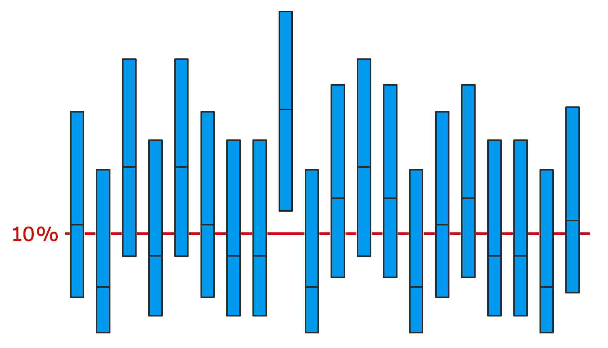
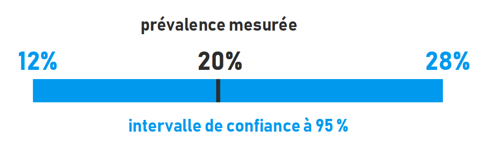
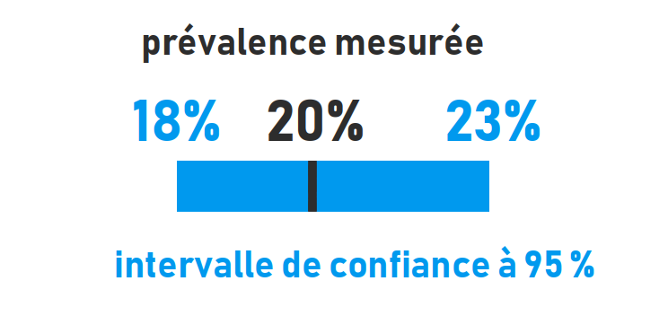

# Fluctuation d'échantillonnage {#sec-fluct}

Une fluctuation d'échantillonnage est une erreur [imprévisible, liée au hasard]{.cb1}. 
C'est pour cette raison qu'elle est qualifiée d'erreur [aléatoire]{.cb1}.

Fluctuation est synonyme de [variabilité]{.cb1}, de variation, ou de "bruit".
Un échantillon est composé d'[individus]{.cb1} au sens premier du terme, c'est-à-dire d'unités indivisibles, qu'il s'agisse de la personne humaine ou non.

En pratique, on parle alors souvent de [variabilité individuelle]{.cb1}.


## La variabilité individuelle

Dans l'exemple de la prise de température chez vos patients (@sec-err), on a vu que la mesure était soumise aux fluctuations d'échantillonnage.
Pourtant, parler de fluctuations d'échantillonnage ici peut porter à confusion.
On comprend le terme de fluctuation, synonyme de variabilité, en revanche on ne voit pas bien de quel échantillon il peut s'agir.

La notion de [variabilité individuelle]{.cb1} est dans ce cas plus concrète : vous prenez la température chez des [individus]{.cb1}, et le résultat [peut varier]{.cb1}.

La variabilité individuelle peut intervenir à deux niveaux :

- Entre les individus (= [inter]{.cb1}individuelle)
: Entre deux patients, la mesure de température ne donne pas la même valeur.  

- Chez un même individu (= [intra]{.cb1}individuelle) 
: La mesure de température répétée chez un même patient peut donner des valeurs différentes. 

La variabilité individuelle peut s'exercer dans de nombreux domaines.

::: callout-tip
## Effets indésirables médicamenteux
Certains individus pourront présenter des effets indésirables graves à un traitement (e.g., chimiothérapie, vaccin), alors que d'autres n'ont présenteront aucun.
:::

::: callout-tip
## La réponse immunitaire aux vaccins 
Bien que la plupart des individus développent une protection immunitaire après la vaccination contre le Covid, un certain pourcentage ne développera pas d'immunité et restera susceptible aux infections.
:::

::: callout-tip
## Récupération post-opératoire
Deux patients peuvent subir la même intervention chirurgicale mais connaître des temps de récupération et des taux de complications très différents, en raison de divers facteurs (e.g., âge, statut nutritionnel, comorbidités)
:::

::: callout-warning
## Pour éviter toute confusion, fluctuation d'échantillonnage et variabilité individuelle peuvent être considérées comme étant synonymes.
:::

## Problème

::: callout-tip
## Prévalence de l'obésité chez les sujets âgés de 30 à 45 ans habitant à Lille (partie II)

On a constitué par tirage au sort un échantillon de 100 sujets dans lequel on a mesuré la prévalence de l'obésité. Cette prévalence est de [20%]{.cb1}.

> **Que faire de cette valeur ? Peut-on simplement la généraliser telle quelle à l'ensemble de la population ?**

Il ne faut pas oublier que cette mesure est soumise aux [fluctuations d'échantillonnage]{.cb1}.
Autrement dit, tout comme la mesure de température répétée chez un même patient, la prévalence mesurée sur de [nouveaux échantillons]{.cb1} seraient [très probablement différente]{.cb1} de 20%. La répétition de la mesure pourrait aussi bien rapporter une prévalence de 7% ou 32%.

> **Peut-on envisager de constituer plusieurs échantillons et de calculer la moyenne des valeurs mesurées dans chacun ?**

Malheureusement, une enquête ne peut porter que sur un échantillon unique ; on ne peut donc porter des conclusions qu'à partir d'une mesure unique.
:::

Cet exemple illustre un problème incontournable dès lors qu'on effectue une mesure sur un échantillon :

::: {.p style="text-align:center"}
**En raison de la [variabilité individuelle]{.cb1}, il y a trop d'[incertitude]{.cb1} associée à la précision de cette mesure pour que celle-ci puisse être présentée seule dans les résultats d'une enquête sur échantillon.**
:::

Comment résoudre ce problème ? En accompagnant la mesure d'un [intervalle]{.cb1} qui rendra compte de la [variabilité autour de cette mesure]{.cb1}.


## Solution : l'intervalle de confiance

Cet intervalle est appelé [intervalle de confiance]{.cb1}.

Il s'étend de part et d'autre de la valeur mesurée dans l'échantillon, et permet de [maîtriser l'incertitude]{.cb1} due aux fluctuations d'échantillonnage avec un certain [niveau de confiance]{.cb1}.

Ce niveau de confiance doit être défini : jusqu'à quel point peut-on avoir confiance dans la précision de l'estimation de la vraie valeur ? Par pure tradition, ce niveau est fixé à [95%]{.cb1}.

::: {.p style="text-align:center"}
**En pratique, on parle alors d'[intervalle de confiance à 95%]{.cb1}.**
:::

Pour rappel, la mesure effectuée dans l'échantillon ne sert qu'à une chose : [estimer la vraie valeur]{.cb1} dans la population de laquelle est issu cet échantillon.

Ainsi, pour une valeur mesurée dans l'échantillon, on calculera l'intervalle de confiance à 95% associé, qui s'étendra de part et d'autre de cette valeur, et qui sera interprété comme étant :

::: {.p style="text-align:center"}
**l'intervalle dont on est sûr à 95% qu'il [contient la vraie valeur]{.cb1} dans**\
**la population de laquelle est issu l'échantillon**
:::


### Simulation

::: callout-note
## Rappel
Dans la vraie vie, la vraie valeur dans la population [ne peut pas être connue]{.cb1} et on cherche, à travers une mesure réalisée sur un [échantillon représentatif]{.cb1} de cette population (@sec-repres), à [estimer cette vraie valeur]{.cb1}.
On fait le présupposé que cette vraie valeur est [fixe]{.cb1} et [unique]{.cb1}.
:::

> **Que se passerait-il si on constituait beaucoup d'échantillons et qu'on calculait pour chacun d'eux un intervalle de confiance à 95% ?**

Imaginons une situation [fictive]{.cb1} dans laquelle [on connait la vraie valeur]{.cb1} de la prévalence d'une maladie quelconque dans une population de 100 000 individus. Admettons que cette valeur soit [10%]{.cb1}.

À partir de cette population, on simule 20 expériences : on constitue [20 échantillons de 1000 individus tirés avec remise]{.cb1} (comme à la loterie). 
Dans chaque échantillon, on mesure la prévalence de la maladie.

On a donc effectué 20 mesures de prévalences ; une valeur par échantillon.
Vous savez maintenant que ces valeurs sont soumises aux fluctuations d'échantillonnage et qu'elles sont donc toutes [plus ou moins différentes]{.cb1} (11, 5, 15, 8, 15, 11, etc.).
À chaque valeur est associé, à l'aide d'un calcul statistique, un intervalle de confiance à 95%.

Au total, on a donc :

- Une population dont on connait la [vraie prévalence]{.cb1} (10%)
- [20 prévalences mesurées]{.cb1} à partir d'échantillons issus de cette population et accompagnées de leur [intervalle de confiance à 95%]{.cb1} 

```{r #fig-ic}
#| out-width: 70%
#| fig-align: center
#| fig-cap: "Simulation de 20 valeurs avec intervalle de confiance à 95%. <br>[La [ligne horizontale]{.cb1} représente la vraie prévalence de la maladie dans la population. Les [barres verticales]{.cb2} représentent les 20 prévalences mesurées accompagnées de leur intervalle de confiance à 95%]{.quarto-float-subcaption}"


```

On constate que l'intervalle de confiance à 95% [contient la vraie valeur dans 19 cas sur 20 (95%)]{.cb1}.
Cette simulation illustre la définition donnée plus haut :

::: {.p style="text-align:center"}
**L'[intervalle de confiance à 95%]{.cb1} est l'intervalle qui, 95 fois sur 100 (ou 19 fois sur 20), [contiendra la vraie valeur]{.cb1} dans la population : on ne connaîtra jamais la vraie valeur avec certitude, mais on fait le pari qu'il y a [95% de chances que l'intervalle contienne cette valeur]{.cb1}.**
:::

### Exemple

Dans la vraie vie, on ne peut pas se permettre de constituer 20 échantillons à partir d'une population, mais seulement un [échantillon unique]{.cb1}.

En pratique, dans la présentation des résultats d'une enquête sur échantillon représentatif, on observera classiquement : 

1. Une [valeur mesurée]{.cb1} sur cet échantillon
2. Toujours accompagnée de son [intervalle de confiance à 95%]{.cb1} afin de tenir compte des [fluctuations d'échantillonnage]{.cb1}.


::: callout-tip
## Prévalence de l'obésité chez les sujets âgés de 30 à 45 ans habitant à Lille (partie III)

La prévalence de l'obésité mesurée dans l'échantillon de 100 sujets est de [20%]{.cb1}. L'intervalle de confiance à 95% correspondant s'étend de [12 à 28%]{.cb1}.

En pratique, le résultat pourrait être présenté de la manière suivante :

::: {.p style="text-align:center"}
**prévalence de l'obésité [IC95%] : 20% [12% ; 28%]**
:::

```{r}
#| out-width: 60%
#| fig-align: center


```

\

::: {.p style="text-align:center"}
**Dans la population, il y a 95% de chances que cet intervalle [contienne la vraie prévalence]{.cb1} de l'obésité**

On peut aussi l'interpréter d'une autre manière :

**Il y a 95% de chances que la prévalence de l'obésité dans la population [soit comprise entre 12 et 28%]{.cb1}**
:::

\

Admettons que l'échantillon ne soit plus composé de 100 sujets, mais de [1000]{.cb1} sujets.
L'intervalle de confiance à 95% correspondant s'étend de [18 à 23%]{.cb1}.

Le résultat est alors le suivant :

::: {.p style="text-align:center"}
**prévalence de l'obésité [IC95%] : 20% [18% ; 23%]**
:::

```{r}
#| out-width: 38%
#| fig-align: center


```

On remarque que pour une même valeur mesurée, l'intervalle est [plus étroit]{.cb1} : l'estimation de la vraie valeur est [plus précise]{.cb1}.
:::

Cet exemple illustre le fait que les fluctuations d'échantillonnage ont pour caractéristique de [diminuer à mesure que la taille de l'échantillon augmente]{.cb1}.
En augmentant la taille de l'échantillon, on augmente la [précision de l'estimation]{.cb1}. 

---

\

::: {.p style="text-align:center"}
## À RETENIR {.unnumbered .unlisted}
:::

::: callout-important
# Fluctuations d'échantillonnage = erreurs aléatoires
:::

::: callout-important
# Elles affectent la précision d'une mesure
:::

::: callout-important
# Elles diminuent à mesure que la taille de l'échantillon augmente
:::

::: callout-important
# Elles sont prises en compte dans la présentation des résultats (intervalle de confiance)
:::
