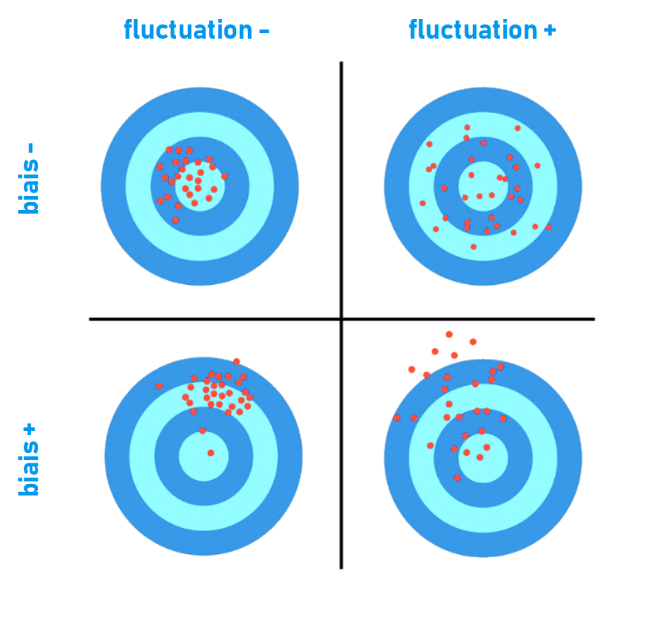

# L'erreur {#sec-err}

On attend de la mesure d'un indicateur deux choses :

1. Qu'elle fournisse la même valeur lorsqu'on la reproduit : sa [fiabilité]{.cb}
2. Qu'elle corresponde bien à la vraie valeur : sa [validité]{.cb}

Une mesure peut parfois s'écarter de la vraie valeur, à laquelle nous n'avons pas accès : c'est ce qu'on peut appeler une [erreur de mesure]{.cb}.

::: callout-tip
## Mesure de la température, (partie II)

L'erreur de calibrage de l'appareil, aboutissant à une surestimation de la température de +1°C, est une erreur [prévisible]{.cb}. Elle se produit à chaque mesure, [toujours dans la même direction]{.cb}. On peut ainsi dire de l'appareil qu'il est [biaisé]{.cb}.

Puisque vous êtes averti du défaut de l'appareil, et que l'erreur qui en résulte est prévisible, vous pouvez [facilement la corriger]{.cb} : pour chaque mesure, il faut soustraire 1°C. 

D'autre part, on a dit que la mesure répétée chez un même patient rapportait *globalement* la même valeur. Globalement, mais pas *exactement*.
Vous remarquez en effet que la valeur peut [varier]{.cb} d'un chiffre après la virgule (38.6, 38.8, 38.8, 38.5, etc.).

Pouvez-vous prédire quel sera ce chiffre avant de réaliser la mesure ? Probablement pas. Cette erreur semble être [liée au hasard]{.cb}. Cette variation imprévisible, aléatoire, est appelée [fluctuation d'échantillonnage]{.cb}.

Cette erreur est de nature différente et ne peut donc pas être corrigée de la même manière.
:::

On a évoqué à travers cet exemple les deux grands types d'erreurs :

---

::: {.p style="text-align:center"}
La fluctuation d'échantillonnage 
: une erreur imprévisible, liée au hasard, dite [aléatoire]{.cb} (@sec-fluct)

Le biais
: une erreur prévisible, prédéterminée, dite [systématique]{.cb} (@sec-biais)
:::

---

Ces deux types d'erreurs peuvent être illustrés en reprenant la @fig-cible, refaisant ainsi le lien avec les notions de [fiabilité]{.cb} et [validité]{.cb} (@sec-temp).

```{r #fig-cible-erreur}
#| out-width: 7in
#| fig-align: center
#| fig-cap: "Fluctuation d'échantillonnage et biais"


```

---

::: {.p style="text-align:center"}
**La [fluctuation d'échantillonnage]{.cb} est une erreur qui affecte la [précision]{.cb} d'une mesure** \
**Le [biais]{.cb} est une erreur qui affecte l'[exactitude]{.cb} d'une mesure**
:::

---

::: callout-warning
## Erreur ou écart ?
Le terme d'erreur peut porter à confusion. Il doit être compris, pas seulement comme une erreur de mesure, mais comme un synonyme d'[écart]{.cb} par rapport à la réalité ou à une valeur attendue.
:::

