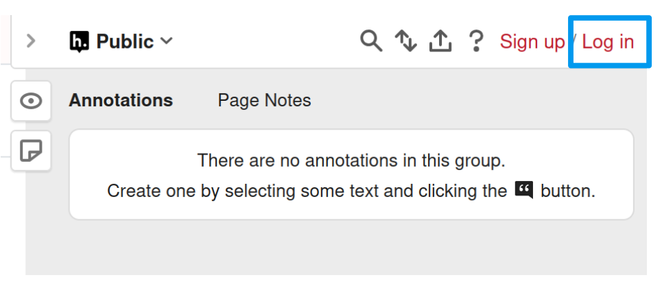

# Présentation du cours

## Important

Le texte [souligné]() peut renvoyer soit à une autre partie du cours (chapitre, section, figure, ...), soit à un lien vers une ressource externe au cours.

Tout lien vers une ressource externes au cours visent uniquement à apporter une information complémentaire, et ne peuvent pas faire l'objet de questions à l'examen. 
Autrement dit, [tout ce qui peut demander de connaitre pour l'examen est présent dans le cours]{.cb1}.

Le cours est centré sur la compréhension des concepts. Il n'est pas demandé de connaitre des listes, des chiffres ou des formules mathématiques.

Une barre de recherche, située dans la barre latérale gauche sur cette page, permet d'effectuer une recherche par mots-clés dans l'ensemble du cours.

Un diapo est en cours de réalisation et sera mis à disposition prochainement.
Des versions Word et PDF seront également misent à disposition. 

## Encadrés

En parcourant le cours, vous rencontrerez différents types d'encadrés ayant chacun une signification précise :

::: callout-note
## Une note/remarque
:::

::: callout-tip
## Un exemple
:::

::: {.callout-caution collapse="true" appearance="minimal"}
## Un énoncé ou une question (cliquer pour afficher la réponse)
La réponse
:::

::: callout-warning
## Une précision sur une notion de cours pouvant porter à confusion
:::

::: callout-important
## Ce qu'il est important de retenir du chapitre (placé en fin de chapitre)
:::

## Annotation et surlignage du texte

Une barre latérale dépliable est présente sur le côté droit de chaque page.

Celle-ci permet d'annoter n'importe quelle partie du cours, de poster une question ou une remarque de façon [libre et ANONYME]{.cb1}. Elle permet également de surligner du texte.

<!-- Pour utiliser cette fonction, il faut se connecter en cliquant sur [Log in]{.cb1} : -->

```{r}
#| out-width: 60%
#| fig-align: center


```

Puis rentrer les identifiants suivants :

  - **Username :** [ifsi_epid]{.cb1}
  - **Password :** [ifsi_epid]{.cb1}

### Notes

Deux types de notes sont possibles :

::: panel-tabset

# **Annotation du texte**

Il s'agit d'une note associée à une partie du texte, que ce soit un paragraphe ou un titre.
Elle est réalisable en sélectionnant la partie du texte à annoter puis en cliquant sur **Annotate**.

```{r}
#| out-width: 90%
#| fig-align: center

knitr::include_graphics("img/hypothesis_annotate.png")
```

N'importe quelle partie du cours peut être annotée.

[L'annotation est ANONYME et publique : elle est visible instantanément pour l'ensemble des personnes consultant la page.]{.cb1}
En revanche, seule une personne connectée à [ifsi_epid]{.cb1} peut ajouter/modifier/supprimer une annotation.

# **Note de page**

Il s'agit d'une note générale liée à la page et non un élement du texte en particulier.

```{r}
#| out-width: 60%
#| fig-align: center

knitr::include_graphics("img/hypothesis_pagenote.png")
```

:::

Il est possible de répondre à des annotations existantes.
Toute annotation peut être supprimée après publication.

### Surlignage

Le surlignage du texte est réalisable en sélectionnant la partie du texte à surligner puis en cliquant sur **Highlight**.

```{r}
#| out-width: 90%
#| fig-align: center

knitr::include_graphics("img/hypothesis_highlight.png")
```

N'importe quelle partie du cours peut être surlignée.

[Contrairement aux annotations, le surlignage est privé : il n'est visible que pour la personne connectée à ifsi_epid, et non pour l'ensemble des personnes consultant la page.]{.cb1}

---

\

Toute action d'annotation ou de surlignage est automatiquement [sauvegardée et conservée]{.cb1} après déconnexion et/ou fermeture de la page.

Cette fonction [ANONYME]{.cb1} est importante pour clarifier des éléments du cours et obtenir un maximum de retours individuels : toute remarque [en lien direct avec le cours]{.cb1} ou [suggestion d'amélioration]{.cb1} est la bienvenue ! 


