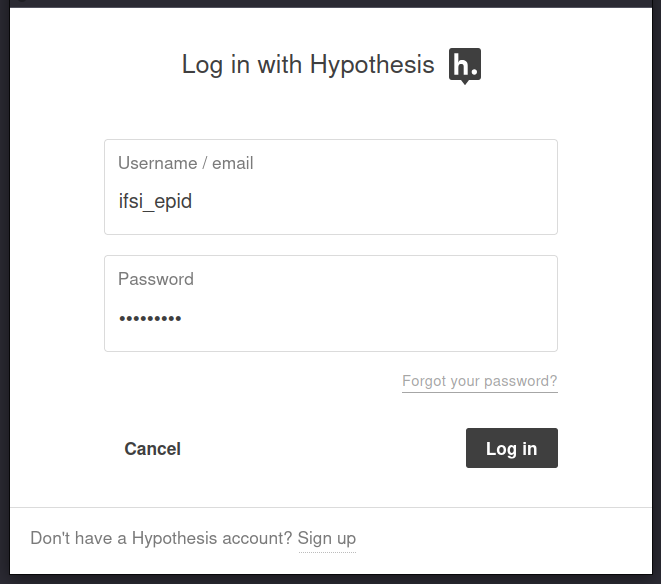
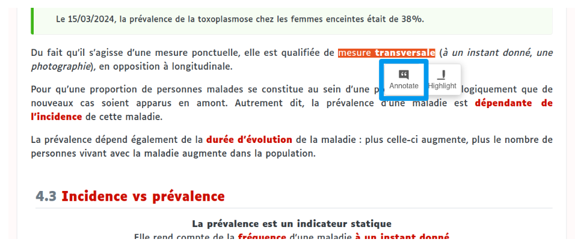
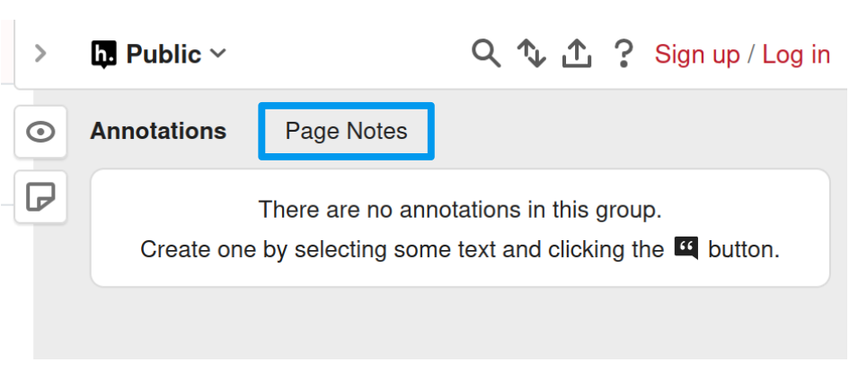
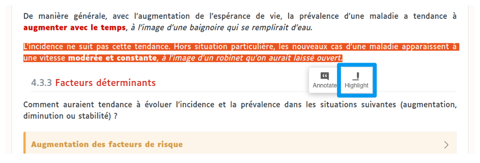

# Présentation du cours

## Important

Le texte [souligné]{.fake-link} peut correspondre soit à un lien vers une autre partie du cours (chapitre, section, figure, ...), soit à un lien vers une ressource externe au cours.

Tout lien vers une ressource externe au cours visent uniquement à apporter une information complémentaire, et ne peut pas faire l'objet de questions à l'examen.
Autrement dit, [tout ce qui pourra être demandé de connaitre pour l'examen est présent dans ce cours]{.cb1}.

Ce cours est centré avant tout sur la compréhension : [il ne sera jamais demandé de connaitre des listes, des chiffres ou des formules mathématiques.]{.cb1}

Une [barre de recherche]{.cb1}, située dans la barre latérale gauche sur cette page, permet d'effectuer une recherche par mots-clés dans l'ensemble du cours.

Un [diapo]{.cb1} est en cours de réalisation et sera mis à disposition prochainement.
Des [formats Word et PDF]{.cb1} de ce cours seront également mis à disposition.

## Encadrés

En parcourant le cours, vous rencontrerez différents types d'encadrés ayant chacun une signification précise :

::: callout-note
## Une note/remarque
:::

::: callout-tip
## Un exemple
:::

::: {.callout-caution collapse="true" icon="false"}
## Un énoncé ou une question (cliquer pour afficher la réponse)
La réponse
:::

::: callout-warning
## Une précision sur une notion de cours pouvant porter à confusion
:::

::: callout-important
## Ce qu'il est important de retenir du chapitre (placé en fin de chapitre)
:::

::: {.content-visible when-format="html"}

## Annotation et surlignage du texte

Une barre latérale dépliable est présente sur le côté droit de chaque page.

Celle-ci permet d'annoter n'importe quelle partie du cours, de poster une question ou une remarque de façon [libre et ANONYME]{.cb1}. Elle permet également de surligner du texte.

Pour utiliser cette fonction, il faut se connecter en cliquant sur [Log in]{.cb1} puis rentrer les identifiants suivants :

  - **Username :** [ifsi_epid]{.cb1}
  - **Password :** [ifsi_epid]{.cb1}

::: {layout-ncol=2}

```{r}
#| out-width: 90%
#| fig-align: center

knitr::include_graphics("img/hypothesis_login_1.png")
```

```{r}
#| fig-align: center


```

:::

### Notes

Il existe deux types de notes :

::: panel-tabset

# **Annotation du texte**

Il s'agit d'une note associée à une partie du texte, que ce soit un paragraphe ou un titre.
Elle est réalisable en sélectionnant la partie du texte à annoter puis en cliquant sur **Annotate**.

```{r}
#| out-width: 90%
#| fig-align: center


```

N'importe quelle partie du cours peut être annotée.

[L'annotation est ANONYME et publique : elle est visible instantanément pour l'ensemble des personnes consultant la page.]{.cb1}
En revanche, seule une personne connectée à **ifsi_epid** et l'intervenant.e peuvent ajouter/modifier/supprimer une annotation, ou répondre à une question.

# **Note de page**

Il s'agit d'une note générale liée à la page et non un élement du texte en particulier.

```{r}
#| out-width: 60%
#| fig-align: center


```

:::

Il est possible de répondre à toute note déjà existante.
Toute note peut être [définitivement supprimée]{.cb1} après publication.

### Surlignage

Le surlignage du texte est réalisable en sélectionnant la partie du texte à surligner puis en cliquant sur **Highlight**.

```{r}
#| out-width: 90%
#| fig-align: center


```

N'importe quelle partie du cours peut être surlignée.

[Contrairement aux annotations, le surlignage est privé : il n'est visible que pour une personne connectée à ifsi_epid, et non pour l'ensemble des personnes consultant la page.]{.cb1}

***

\

Toute action d'annotation ou de surlignage est automatiquement [sauvegardée et conservée]{.cb1} après déconnexion et/ou fermeture de la page.

Cette fonction [ANONYME]{.cb1} est importante pour clarifier des éléments du cours et recueillir un maximum de retours individuels : toute [question]{.cb1}, toute [remarque en lien direct avec le cours]{.cb1} ou [suggestion d'amélioration]{.cb1} est la bienvenue !

:::
