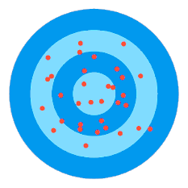
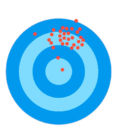
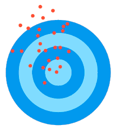

# Mesures de base {#sec-indic}

Un [indicateur de santé]{.cb} est une variable spécifiquement définie et mesurée dans le but de [décrire et suivre l'état de santé]{.cb} d'une population.

C'est un outil d'[évaluation]{.cb} des problèmes de santé, d'[aide à la décision]{.cb} et de [surveillance]{.cb} de l'efficacité des interventions de santé publique.

Tout indicateur est composé d'un [numérateur]{.cb} et d'un [dénominateur]{.cb}, et doit être défini en tenant compte de trois éléments :

- [Temps]{.cb} 
: Préciser la période pendant laquelle les données ont été collectées pour observer les tendances au fil du temps (e.g., variations saisonnières des maladies infectieuses)

- [Espace]{.cb}
: Identifier les zones géographiques concernées pour pouvoir comparer différentes régions entre elles

- [Personne]{.cb}
: Tenir compte des caractéristiques démographiques de la population étudiée (e.g., âge, sexe, statut socio-économique) pour cibler les interventions vers les groupes les plus à risque.

Les indicateurs de base présentés dans ce chapitre sont à l'origine de deux grandes catégories d'indicateurs de santé :

- Les indicateurs de [mortalité]{.cb} (@sec-mrt)
- Les indicateurs de [morbidité]{.cb} (@sec-mrb) 

## Indicateurs de base

### Proportion {#sec-prop}

Une proportion est un rapport dans lequel [le numérateur est inclus dans le dénominateur]{.cb}.

Il s'exprime en pourcentage ou en un chiffre compris entre 0 et 1.

::: callout-tip
## En 2023, sur 750 000 enfants de 24 mois, 600 000 sont correctement vaccinés contre la rougeole.

La proportion correspondante est $\frac{600 \ 000}{750 \ 000}$ = 0,8 \
La couverture vaccinale contre la rougeole chez les enfants de 24 mois est de 80%.
:::

### Taux {#sec-taux}

Un taux mesure le [risque]{.cb} de survenue d'un évènement [au cours d'une période]{.cb}. 

Il s'exprime en pourcentage ou en un chiffre compris entre 0 et 1.

>
$$
\mathrm{
\frac
{Nombre \ d'évènements}
{Nombre \ de \ sujet \ à \ risque \ de \ faire \ l'évènement}
\ \ sur \ une \ période \ donnée
}
$$

::: callout-tip
## Dans une maternelle, sur 200 enfants n'ayant jamais eu la varicelle et non vaccinés, il y a eu 72 nouveaux cas durant l'année scolaire 2021-2022.

Nombre d'évènements : 72 nouveaux cas de varicelle \
Nombre de sujets à risque de faire l'évènement : 200 enfants n'ayant jamais eu la varicelle et non vaccinés \
Sur une période donnée : l'année scolaire 2021-2022

Le taux correspondant est $\frac{72}{200}$ = 0,36 \
Durant l'année scolaire 2021-2022, il y a eu 36 nouveaux cas de varicelle pour 100 enfants à risque
:::

### Ratio 

Un ratio est un rapport des effectifs entre [deux modalités d'une variable binaire]{.cb}.

Les modalités d'une variable binaire sont [mutuellement exclusives]{.cb} : contrairement à une proportion, le numérateur ne peut pas être inclus dans le dénominateur.

Puisqu'il s'agit de la même unité au numérateur et au dénominateur, c'est un rapport [sans unité]{.cb}.

::: callout-tip
## En considérant que le sexe est une variable binaire (homme/femme), le "sex ratio" correspond au rapport du nombre d'hommes sur le nombre de femmes (ou inversement)

Classiquement, le sex ratio est présenté avec les hommes à gauche et les femmes à droite :

- Le sex ratio de la schizophrénie est de 3/1 
: La schizophrénie concerne 3 fois plus souvent les hommes que les femmes

- Le sex ratio de l'anorexie mentale est de 1/9 
: L'anorexie mentale concerne 9 fois plus souvent les femmes que les hommes
:::

### Indice

Un indice est le rapport entre deux effectifs [de nature différente]{.cb}.

::: callout-tip
## 30 enfants sont hospitalisés dans un service de pédiatrie. Dans ce service, il y a 3 IDE.

Deux effectifs de nature différente :

- Nombre d'enfants
- Nombre d'IDE

L'indice correspondant est 30 pour 3, ou 10 pour 1 : il y a 10 enfants par IDE.
:::

## Exercices

Pour chaque énoncé, quel est l'indicateur de base correspondant ?

::: {.callout-caution collapse="true" appearance="minimal"}

## Nombre de cancers cutanés / nombre de cancers 

>
Nombre de cancers = l'ensemble des cancers \
Les cancers cutanés sont un sous-ensemble des cancers

Le numérateur est inclut dans le dénominateur : c'est une [proportion]{.cb}
:::

::: {.callout-caution collapse="true" appearance="minimal"}
## Nombre de cigarettes consommées par habitant 

>
2 effectifs de nature différente : \
\ \ \ \ - Nombre de cigarettes \
\ \ \ \ - Nombre d'habitants
  
Rapport entre 2 effectifs de nature différente : c'est un [indice]{.cb}
:::

::: {.callout-caution collapse="true" appearance="minimal"}
## Nombre de fumeurs / Nombre de non fumeurs

>
Une variable : le statut tabagique\
C'est une variable binaire : fumeur / non fumeur

Rapport entre les deux modalités d'une variable binaire : c'est un [ratio]{.cb}
:::

::: {.callout-caution collapse="true" appearance="minimal"}
## Nombre de femmes enceintes vaccinées contre la rubéole / nombre de femmes enceintes

>
Nombre de femmes enceintes = l'ensemble des femmes enceintes \
Les femmes enceintes vaccinées contre la rubéole sont un sous-ensemble des femmes enceintes

Le numérateur est inclut dans le dénominateur : c'est une [proportion]{.cb}
:::

::: {.callout-caution collapse="true" appearance="minimal"}
## Nombre de décès survenus du 1er janvier au 01 juin 2023 / nombre de personnes à risque de décéder sur cette période

>
Un évènement : le décès \
Notion de risque \
Mesuré sur une période : du 01/01/2023 au 01/06/2023

On mesure la survenue d'un évènement parmi les personnes à risque de faire cet évènement, sur une période donnée : c'est un [taux]{.cb}
:::

## Critères de qualité d'un indicateur

Pour être de qualité, un indicateur de santé doit être :

- [Simple et acceptable]{.cb}
: Facilement utilisable par les chercheurs, facilement compréhensible par les professionnels et les usagers

::: callout-tip
## Le taux de mortalité infantile est une mesure simple et consensuelle du nombre d'enfants décédés entre la naissance et 12 mois parmi toutes les naissances vivantes dans une population donnée
:::

- [Valide]{.cb}
: La mesure est-elle pertinente ? Correspond-elle à ce qu'on souhaite mesurer ?

::: callout-tip
## La mesure autonome de la pression artérielle (MAPA) mesure la pression artérielle en conditions de vie réelle, par opposition à une mesure prise dans un contexte clinique pouvant être influencée par le stress (effet "blouse blanche") 
:::

- [Fiable]{.cb}
: Si la mesure est répétée dans des conditions similaires, elle doit produire des résultats similaires

::: callout-tip
## La reproduction de la MAPA sur plusieurs jours et à intervalles réguliers dans les mêmes conditions environnementales permet d'évaluer sa fiabilité
:::

- [Sensible]{.cb}
: La mesure peut détecter des petites changements dans le phénomène étudié

::: callout-tip
## Un test de dépistage du cancer du sein doit être suffisamment sensible pour détecter une tumeur à un stade précoce, lorsque le traitement est le plus efficace
:::

- [Spécifique]{.cb}
: La mesure détecte uniquement le phénomène étudié

::: callout-tip
## Un test de dépistage du VIH doit être spécifique à l'infection à VIH et ne pas donner de résultats positifs pour d'autres infections virales
:::

## Fiabilité vs validité {#sec-temp}

::: {.p style="text-align:center"}
**[Fiabilité]{.cb} est synonyme de [précision]{.cb} (ou reproductibilité)** \
**[Validité]{.cb} est synonyme d'[exactitude]{.cb} (ou pertinence)**
:::

On peut illustrer précision et exactitude en symbolisant la mesure avec une cible et un ensemble de points, chacun représentant une mesure :

- La précision étant symbolisée par la dispersion entre les points
- L'exactitude étant symbolisée par le centre de la cible : c'est la "vraie" valeur qu'on cherche à atteindre

Quatre situations sont possibles :

::: {#fig-cible layout-ncol=2 layout-nrow=2}

{#fig-cible-a}

{#fig-cible-b}

{#fig-cible-c}

{#fig-cible-d}

Précision et exactitude
:::

La @fig-cible-a représente la situation idéale. La répétition de la mesure donne globalement la même valeur, celle-ci étant proche de la réalité : la mesure est [fiable et valide]{.cb}.

La @fig-cible-b représente une situation problématique : la répétition de la mesure ne donne jamais la même valeur. Elle peut parfois donner la bonne valeur, mais de façon imprévisible, par "chance" : la mesure [peut être valide, mais elle n'est pas fiable]{.cb}.

La @fig-cible-c représente une situation fréquente en pratique. La répétition de la mesure donne globalement la même valeur, mais celle-ci ne correspond pas à la réalité : la mesure est [fiable mais pas valide]{.cb}.

La @fig-cible-d représente une situation où la mesure n'apporte pas d'information. Sa répétition ne donne jamais la même valeur, et rarement la bonne valeur : la mesure n'est [ni fiable ni valide]{.cb}.

::: {.p style="text-align:center"}

Une mesure [exacte mais imprécise]{.cb} donnerait des bonnes valeurs [par hasard]{.cb}
: Elle ne serait pas utilisable en pratique

Une mesure [précise mais inexacte]{.cb} donnerait des valeurs fiables [mais fausses]{.cb}
: Elle serait utilisable en pratique de par sa fiabilité, mais donnerait une vision erronée de la réalité

:::

::: callout-tip
## Mesure de la température (partie 1)
Lors de votre première tournée dans un nouveau service, vous devez prendre la température chez les patients de votre secteur.
On vous a informé pendant les transmissions que le thermomètre que vous utilisez, le seul disponible dans ce service, a un défaut de calibrage : il surestime la température de +1°C.

Lorsque vous reprenez plusieurs fois d'affilée la mesure chez un même patient, il est très probable que vous obteniez *globalement* le même résultat : votre mesure de température est [fiable]{.cb}.

Est-elle valide pour autant ? Souvenez-vous qu'en raison du défaut de calibrage de l'appareil, chaque valeur mesurée surestime la température de +1°C : aussi fiable soit-elle, la mesure [ne correspond pas à la réalité]{.cb}.

Autrement dit :

::: {.p style="text-align:center"}
La mesure est [fiable]{.cb}
: la répétition de la mesure reproduit *globalement* le même résultat 

Pour autant, la mesure n'est [pas valide]{.cb}
: l'appareil surestime la température de +1°C
:::
:::

---
\

::: {.p style="text-align:center"}
## MESSAGES IMPORTANTS {.unnumbered .unlisted}
:::

::: callout-important
## [Bien distinguer les indicateurs de base]{.cb}
:::

::: callout-important
## [Un taux intègre la notion de risque et de temps]{.cb}
:::

::: callout-important
## [Un ratio s'applique à une variable binaire]{.cb}
:::

::: callout-important
## [La fiabilité se réfère à la précision ; la validité se réfère à l'exactitude]{.cb}
:::

::: callout-important
## [Une mesure peut être fiable sans être valide]{.cb}
:::
