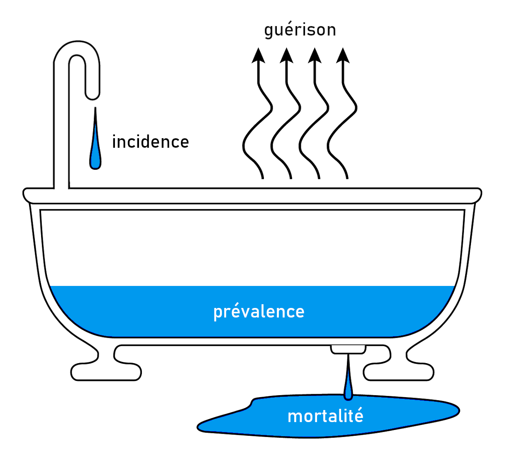
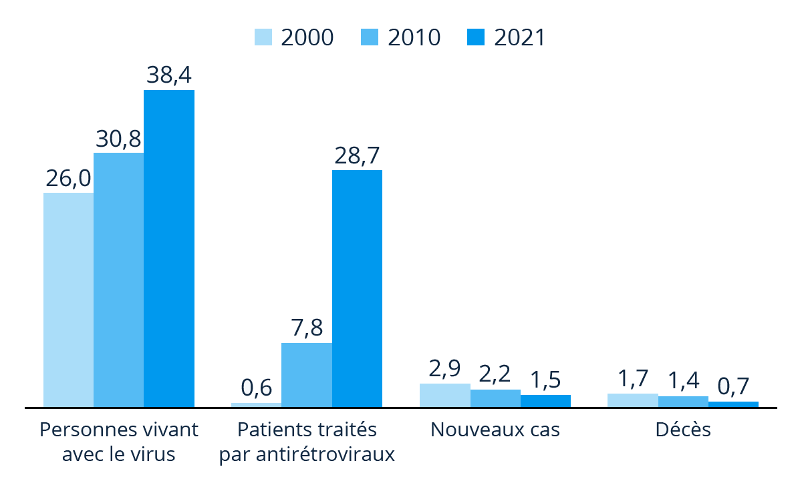

# Indicateurs de morbidité {#sec-mrb}

La [morbidité]{.cb} se réfère au fait d'être [atteint d'une maladie]{.cb}.

::: callout-note
## Mesurer la morbidité : éléments philosophiques

*La mesure de morbidité est un concept. Elle est un moyen de se représenter de manière simplifiée et tangible un phénomène de santé, qui lui est bien réel et complexe.*

*La morbidité est multidimensionnelle (morbidité ressentie, diagnostiquée, objectivée, déclarée...). Quelle définition faut-il adopter ? Celle-ci peut varier selon les perspectives cliniques, épidémiologiques, voire même culturelles.* 

*Ainsi, comment mesurer la morbidité ? Par le biais de l'individu ? De son médecin ? D'un paramètre biologique ? Quand est-ce qu'elle commence et quand est-ce qu'elle finit ?*
:::

Il existe en pratique deux indicateurs de morbidité : l'[incidence]{.cb} et la [prévalence]{.cb}.


## Incidence {#sec-inc}

L'incidence est un [taux]{.cb} (@sec-taux).

Un [taux d'incidence]{.cb} est un taux appliqué à [la survenue de nouveaux cas]{.cb} d'une maladie dans une population.

> 
$$
\mathrm{
\frac
{Nombre \ de \ nouveaux \ cas \ d'une \ maladie}
{Nombre \ de \ personnes \ à \ risque \ de \ devenir \ malade}
\ \ 
sur \ une \ période \ donnée
}
$$

Puisqu'il s'agit d'une mesure prise sur une période, elle est qualifiée de mesure [longitudinale]{.cb} (*en longueur*, *d'un point A à un point B*).

Le taux d'incidence reflète la [vitesse de survenue]{.cb} d'une maladie dans une population.

::: callout-tip
## Exemple
/###
:::


## Prévalence {#sec-prev}

La [prévalence]{.cb} est une [proportion]{.cb} (@sec-prop).

C'est la proportion de [personnes atteintes d'une maladie à un instant donné]{.cb} dans une population.

>
$$
\mathrm{
\frac
{Nombre \ de \ cas \ d'une \ maladie}
{Ensemble \ de \ la \ population}
\ \ 
à \ un \ instant \ donné
}
$$

::: callout-tip
## Lors d'une enquête nationale réalisée sur les 3000 femmes enceintes ayant accouché le 15/03/2024, 1150 ont été dépistées positives à la toxoplasmose.

La prévalence était de $\frac{1150}{3000}$ = 0,38 \
Le 15/03/2024, la prévalence de la toxoplasmose chez les femmes enceintes était de 38%.
:::

Du fait qu'il s'agisse d'une mesure ponctuelle, elle est qualifiée de mesure [transversale]{.cb} (*à un instant donné*, *une photographie*), en opposition à longitudinale.

Pour qu'une proportion de personnes malades soit constituée au sein d'une population, il faut logiquement que de nouveaux cas soient apparus en amont.
Autrement dit, la prévalence d'une maladie est [dépendante de son incidence]{.cb}. 

La prévalence dépend également de la [durée d'évolution]{.cb} de la maladie : plus celle-ci augmente, plus la prévalence augmente. 


## Incidence vs prévalence

::: {.p style="text-align:center"}
La prévalence est un indicateur [statique]{.cb}
: Elle rend compte de la [fréquence]{.cb} d'une maladie [à un instant donné]{.cb}

L'incidence est un indicateur [dynamique]{.cb}
: Elle rend compte de la [vitesse]{.cb} à laquelle une maladie survient [sur une période donnée]{.cb}
:::


### Analogie : la baignoire de l'épidémiologiste

L'incidence, la prévalence et la relation qui existe entre elles peuvent être illustrées avec [la baignoire de l'épidémiologiste]{.cb} (@fig-baignoire).

Cette allégories est constituée classiquement de 4 éléments :

- Un robinet ouvert
- Un volume d'eau occupant la baignoire
- Une évacuation
- Une évaporation

Le débit d'eau entrant représente les nouveaux cas de malades : c'est l'[incidence]{.cb}.

Le volume d'eau représente le proportion d'individus malades dans la population : c'est la [prévalence]{.cb}.

L'évacuation symbolise une proportion sortant de la population malade : c'est la [mortalité]{.cb}.

La mort n'est pas la seule manière de ne plus être malade : il y a aussi une possibilité de [guérison ou rémission]{.cb}.
Ce dernier élément peut être symbolisé par l'évaporation.

```{r #fig-baignoire}
#| out-width: 4.5in
#| fig-align: center
#| fig-cap: "La baignoire de l'épidémiologiste"


```

En résumé, il s'agit d'un circuit ouvert avec :

- Un débit [entrant]{.cb} : l'apparition de nouveaux cas = [incidence]{.cb}
- Un volume [constitué]{.cb} : le nombre de cas constitués dans la population = [prévalence]{.cb}
- Un débit [sortant]{.cb} : la [mort]{.cb} ou la [guérison]{.cb}

Ainsi, bien que le robinet soit constamment ouvert, la baignoire ne déborde pas. En revanche, s'il y a une limite à la sortie, le niveau d'eau aura tendance à augmenter avec le temps.


### Exemple : l'infection à VIH

L'incidence, la prévalence et leur dynamique peuvent être représentées graphiquement à travers l'exemple de l'infection à VIH.

```{r #fig-vih}
#| out-width: 6in
#| fig-align: center
#| fig-cap: "État de l'épidémie de SIDA dans le monde (en millions)"


```

L'infection à VIH est pourvoyeuse du SIDA, une maladie pour laquelle il n'y a pas de guérison.

De plus les progrès de la médecine ont changé la donne en permettant une augmentation notable de l'espérance de vie, autrement dit en permettant aux gens de moins mourir de la maladie. C'est ainsi qu'on parle de [maladie chronique]{.cb}.

La prévalence d'une maladie a tendance à augmenter avec le temps, à l'image d'une baignoire qui se remplirait d'eau.

L'incidence ne suit pas cette tendance. Hors situation d'épidémie, les nouveaux cas d'une maladie apparaissent à une vitesse modérée et constante, à l'image d'un robinet qu'on aurait laissé ouvert.


### Facteurs déterminants

Comment auraient tendance à évoluer l'incidence et la prévalence dans les situations suivantes (augmentation, diminution, stabilité) ?

```{r}
library(gt)
library(dplyr)
library(purrr)

gt_arrow <- \(...) {

  tibble::tibble(...) |> 
    gt() |> 
    fmt_icon(columns = c("incidence", "prévalence")) |> 
    cols_align(align = "center",
               columns = everything()) |>
    tab_style(style = cell_text(weight = "bold"),
              locations = cells_column_labels())
  
}

title <-
c("Augmentation des facteurs de risque",
  "Amélioration de la prise en charge : guérison plus rapide",
  "Amélioration de la prise en charge : survie plus longue",
  "Amélioration des méthodes diagnostiques",
  "Meilleure déclaration",
  "Changement de définition de la maladie")

tab <-
list(gt_arrow(incidence = "arrow-up-long",
              prévalence = "arrow-up-long"),
     gt_arrow(incidence = "arrow-right-long",
              prévalence = "arrow-down-long"),
     gt_arrow(incidence = "arrow-right-long",
              prévalence = "arrow-up-long"),
     gt_arrow(incidence = "arrow-up-long",
              prévalence = "arrow-up-long"),
     gt_arrow(incidence = "arrow-up-long",
              prévalence = "arrow-up-long"),
     gt_arrow(incidence = "question",
              prévalence = "question"))
```

/### détail pour chaque

::: {.callout-caution collapse="true" appearance="minimal"}
## `r title[1]`
```{r}
tab[[1]]
```
:::

::: {.callout-caution collapse="true" appearance="minimal"}
## `r title[2]`
```{r}
tab[[2]]
```
:::

::: {.callout-caution collapse="true" appearance="minimal"}
## `r title[3]`
```{r}
tab[[3]]
```
:::

::: {.callout-caution collapse="true" appearance="minimal"}
## `r title[4]`
```{r}
tab[[4]]
```
:::

::: {.callout-caution collapse="true" appearance="minimal"}
## `r title[5]`
```{r}
tab[[5]]
```
:::

::: {.callout-caution collapse="true" appearance="minimal"}
## `r title[6]`
```{r}
tab[[6]]
```
:::

---

::: {.callout-caution collapse="true" appearance="minimal"}
## Facteurs déterminants : synthèse
```{r}
tab |> 
  map(~ .[["_data"]]) |> 
  list_rbind() |> 
  mutate(" " = title,
         .before = everything()) |>
  gt_arrow() |> 
  cols_width(" " ~ pct(75))
```
:::


## Incidence ou prévalence ?

::: {.callout-caution collapse="true" appearance="minimal"}
## Sur les 30 derniers jours, 15 patients ont été hospitalisés en réanimation pour septicémie

Nombre de nouveaux cas sur une période donnée : c'est une [incidence]{.cb}
:::

::: {.callout-caution collapse="true" appearance="minimal"}
## Au 01/01/2024, il y avait 5% de cas de cancer de la prostate chez les hommes habitant dans la région Hauts-de-France

Proportion à un instant donné : c'est une [prévalence]{.cb}
:::

---
\

::: {.p style="text-align:center"}
## TAKE-HOME MESSAGES {.unnumbered .unlisted}
:::

::: callout-important
## [Bien distinguer incidence et prévalence (penser à la baignoire)]{.cb}
:::

::: callout-important
## [La prévalence des maladies a tendance à augmenter avec le temps]{.cb}
:::

::: callout-important
## [La prévalence est dépendante de l'incidence]{.cb}
:::
