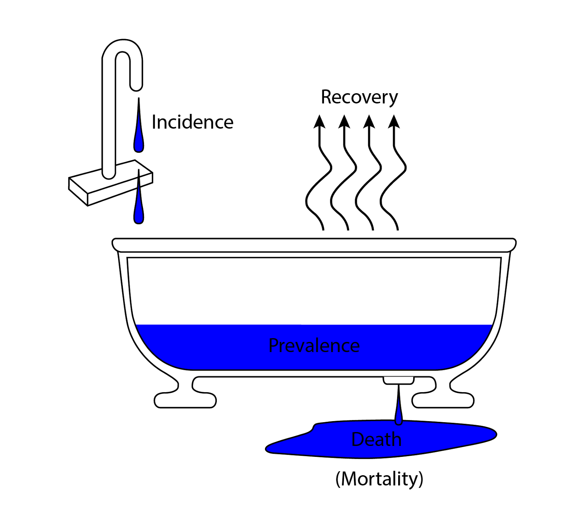
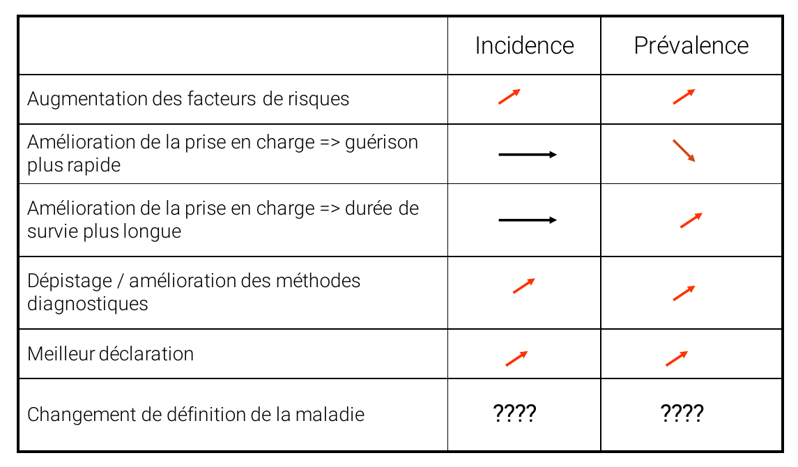

# Indicateurs de morbidité {#sec-mrb}

Le terme de [morbidité]{.cb} est relatif au fait d'être [atteint d'une maladie]{.cb}.

Il existe en pratique deux indicateurs de morbidité :

- L'[incidence]{.cb}
- La [prévalence]{.cb}

Problèmes de la mesure de la morbidité 

- Qu'est-ce qu'une maladie? Quelle définition adopter? 
- Quand commence une maladie? (ex: maladie d’Alzheimer) 
- Quand finit une maladie? 
- Comment mesurer cette morbidité? En interrogeant l’individu? Son médecin? En mesurant un paramètre?

La morbidité peut se distinguer en plusieurs types : 

- La morbidité [ressentie]{.cb} 
- La morbidité [diagnostiquée]{.cb} : affections diagnostiquées par les médecins 
- La morbidité [objectivée]{.cb} : affections diagnostiquées à l’aide d’un examen systématique 
- La morbidité [déclarée]{.cb}

Évolution de la connaissance (A) et de la part traitée et contrôlée (B) de l’hypertension artérielle (HTA) chez les personnes hypertendues entre ENNS 2006 et Esteban 2015, en fonction du sexe.

img hta


## Incidence

L'incidence est un [taux]{.cb} (@sec-taux). Le terme d'incidence est par ailleurs synonyme en pratique de [taux d'incidence]{.cb}.

Il s'agit d'un taux appliqué à [l'apparition de nouveaux cas]{.cb} d'une maladie dans une population.

$$
\mathrm{
\frac
{Nombre \ de \ nouveaux \ cas \ apparus \ pendant \ une \ durée \ T}
{Nombre \ de \ personnes-temps \ à \ risque \ pendant \ cette \ durée \ T}
}
$$

::: callout-note
## Personnes-temps ?


:::


Puisqu'il s'agit d'une mesure prise sur une période, elle est qualifiée de mesure [longitudinale]{.cb} (*en longueur*, *d'un point A à un point B*).

L'incidence reflète la [vitesse d'apparition de nouveaux cas]{.cb} d'une maladie dans une population.


## Prévalence

La [prévalence]{.cb} est une [proportion]{.cb} (@sec-prop).

C'est la [proportion]{.cb} d'individus atteints d'une maladie, [à un instant donné]{.cb}, dans une population.

$$
\mathrm{
\frac
{Nombre \ de \ cas \ d'une \ maladie}
{Ensemble \ de \ la \ population}
}
$$


Du fait qu'il s'agisse d'une mesure ponctuelle, elle est qualifiée de mesure [transversale]{.cb} (*à un instant T*, *une photographie*), en opposition à longitudinale.

Pour qu'une proportion d'individus malades se constitue au sein d'une population, il faut bien sûr que de nouveaux cas de cette maladie soient apparus en amont.
Autrement dit, la prévalence est [dépendante de l'incidence]{.cb}. 

Elle dépend également de la [durée d'évolution]{.cb} de la maladie : plus celle-ci augmente, plus la prévalence augmente. 


## Incidence vs prévalence

### Analogie : la baignoire de l'épidémiologiste

La baignoire de l'épidémiologiste.

Cette image comporte classiquement 3 éléments :

- Le volume d'eau occupant la baignoire
- Le robinet ouvert
- L'évacuation

[img baignoire]

La baignoire dans son ensemble symbolise la morbidité. Elle se situe , qui symbolise l'ensemble de la population.

Le volume d'eau représente le proportion d'individus malades dans la population : c'est la [prévalence]{.cb}.

Le débit d'eau entrant représente les nouveaux cas de malades : c'est l'[incidence]{.cb}.

L'évacuation représente les individus sortant de la population de malades : c'est la [mortalité]{.cb}.

La mort n'est pas la seule manière de ne plus être malade : il y a une possibilité de [guérison/rémission]{.cb} de la maladie en question.
On peut symboliser ce dernier élément par l'évaporation.

```{r}
#| out-width: 6in
#| fig-align: center


```

L'image de la baignoire est plutôt bonne : c'est un circuit ouvert avec entrée et sortie. De ce fait, bien que le robinet sort constamment ouvert, la baignoire ne déborde jamais.

### Exemple : l'infection à VIH

> *La baignoire ne déborde jamais, mais le niveau d'eau augmente petit à petit.*

Qu'est-ce que ça signifie ?

Infection à VIH, en représentant graphiquement incidence et prévalence.

```{r}
#| out-width: 5in
#| fig-align: center

knitr::include_graphics("img/vih.png")
```

L'infection à VIH est pourvoyeuse du **SIDA** (**S**yndrome d'**I**mmuno-**D**éficience **A**cquise), ayant pour caractéristique d'être une maladie donc on ne guérit pas.

Les progrès de la médecine ont changé la donne en permettant une augmentation notable de l'espérance de vie, autrement dit en permettant aux gens de moins mourir de la maladie. Par conséquent on parle de maladie [chronique]{.cb}.

La prévalence d'une maladie a tendance à augmenter avec le temps, à l'image d'une baignoire qui se remplirait d'eau.

L'incidence ne suit pas cette tendance. Hors situation d'épidémie, les nouveaux cas d'une maladie apparaissent à une vitesse modérée et constante, à l'image d'un robinet qu'on aurait laissé ouvert.


### Facteurs déterminants

```{r}
#| out-width: 6in
#| fig-align: center


```

## Ce qu'il faut retenir

- [Bien différencier incidence et prévalence (penser à la baignoire !)]{.cb}
- [Comprendre l'évolution de l'incidence et de la prévalence]{.cb}
- La prévalence est dépendante de l'incidence
